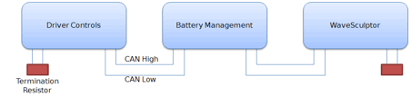
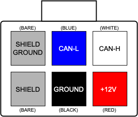

# CAN Bus and Low Voltage

The CAN bus is structured as a linear network, with short stubs branching from 'T' connectors on the main bus backbone to each device.  The CAN bus data lines must be terminated at each end of the main bus with 120 ohm resistors between the CAN-H and CAN-L signals.

In the range of Prohelion EV products, including the [WaveSculptor 22](../User_Manual/0_Overview.md), [EV Driver Controls](../../../Driver_Controls/User_Manual/0_Overview.md), and [Battery Management Systems](../../../Battery_Management_Systems/0_Overview.md), the CAN connections are implemented with an 'in' and an 'out' connector, therefore placing the 'T' on the device, resulting in a very short fixed-length stub on the circuit board of each device.  This is ideal from a signal integrity and network performance point of view.

The WaveSculptor motor controller uses the CAN bus to receive commands and transmit telemetry, as well as to provide low-voltage DC power to operate the controller electronics.

Therefore, a basic system consists of three major components:
1.	WaveSculptor motor controller
2.	Driver controls interface to pedals, switches & gauges
3.	Power supply (nominally 12V DC) to operate the system

Other components can also be added to the network. Items typically found in a solar electric vehicle would include:
4.	LCD and other driver information displays
5.	Battery management system
6.	Multiple motor controllers
7.	Datalogging and RF telemetry

## CAN Wiring 

The CAN data lines (CAN-H and CAN-L) must be implemented with twisted-pair wire for proper data integrity.  The wire should have a characteristic impedance of 120 ohms.

Power should also be provided along the CAN cable, ideally with another twisted pair to minimise noise pickup.  An overall shield can also be advantageous.  

From a performance perspective, the optimal choice of cable is 7mm Devicenet CANbus 'thin' cable, with 24AWG (data) + 22AWG (power) twisted pairs and a braided shield.  Using this cable will result in a robust installation.  

## CAN Connector

The connector used on the WaveSculptor22 and other Prohelion devices is a 6-way 3mm pitch Molex MicroFit connector.  The pinout is shown below, as viewed from the wire side – as you would look at it while inserting crimps. 

The colours shown match those in the standard DeviceNet CAN cabling pairs.  Please refer to [Appendix B](Appendix_B.md) for an overview of correct crimping technique, as poor crimps will cause unreliable operation.

## CAN Shielding 

If the recommended braided shield is used in the cable, then terminate it to the SHIELD pin (lower-left corner on the connector) on both CAN IN and CAN OUT connectors on each device.  

On <strong>one device only</strong> in the network, instead of using the SHIELD pin, terminate the shield to the SHIELD GROUND pin (upper-left corner on the connector) on both CAN IN and CAN OUT connectors, to ground the shield for the entire network at this single point.  The usual place to do this is where power is fed into the network, typically at Prohelion 's EV Driver Controls product.

## CAN Termination

To implement the required 120 Ohm termination resistor at each end of the CAN bus, plug a connector into the unused CAN connector on the last device at each end of the network with a resistor crimped into the appropriate locations.  Leave the power, ground and shield pins unconnected.

## Communications

The CAN standard does not specify high-level message protocols. Prohelion devices use a custom protocol, outlined in the communication specification document for each device.

By default, each device operates at 500 kbits/second, one step below the maximum possible data rate of 1 Mbit/second, and comes programmed from the factory with a CAN base address that will allow it to work without problems with other Prohelion devices. Using the Windows PC interface program and the Prohelion CAN-Ethernet bridge, both the data rate and the base address can be programmed to suit your network.

WaveSculptor controllers also have a second programmable base address that they watch for command messages. This should be set to whatever base address is used by the driver controls node on the network.

The WaveSculptor motor controller expects regular messages from the driver controls device.  If a message is not received within a set timeout period (refer to the communications specification in [Appendix A](Appendix_A.md) for the exact value) then the controller will change to a safe mode and will stop driving the motor until a valid message is received again. This protects against faults where either a connector is loose or broken, the cable has been damaged, or the driver controls have failed.

## Power Supply

Each Prohelion device expects a DC supply on the CAN bus connection of between 9 and 15V.  13.8V from a small lead-acid battery charged by your vehicle's DC/DC converter is ideal.  Refer to each device’s datasheet for CAN bus current consumption values, and make sure that the total is less than the rating on your chosen cable.

Prohelion 's EV Driver Controls product provides a means to connect power from the battery into the CAN bus, to power other devices on the network.  It can switch power to the CAN bus based on the state of the ignition key.

## Driver Controls

Prohelion can provide a CAN bus driver controls device.  This interfaces to pedals and switches, and provides the messages required to operate a WaveSculptor controller. The firmware for this device is open-source, allowing it to be easily customized to suit your vehicle.

As the communications specification is open, the WaveSculptor can also be operated from custom driver controls hardware specific to your vehicle, or from a Windows PC running either the provided Prohelion software, or custom software of your choice.

Please refer to the [Driver Controls Datasheet]()??? and [User Manual](../../../Driver_Controls/User_Manual/0_Overview.md) on our website for further details. 

## System Expansion

Prohelion can provide a CAN bus LCD display capable of showing up to four different telemetry values (one at a time) on a 3.5 digit sunlight-readable screen.  Multiple displays can be used if desired.  

## Multiple Motors

Multiple motors/controllers are accommodated easily with the CAN bus system. All that is required is for each WaveSculptor controller to be programmed to receive messages from the same driver controls base address, and then to run the vehicle in current-control mode (the default setup). Each motor will now operate at the same current, thus giving automatic wheel speed differences for cornering, with the system acting as an electronic differential.

The base address of each WaveSculptor controller should be programmed to a different value. This allows viewing of separate telemetry data from each controller on the LCD displays or other telemetry systems in the vehicle.