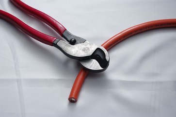
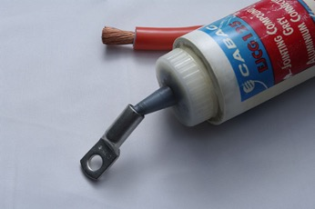
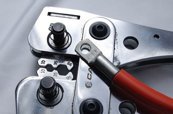
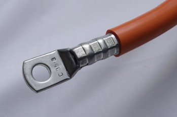
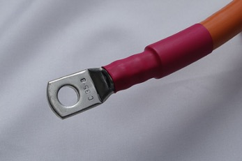

# Appendix B: Guide to Successful Crimping

## Molex MicroFit 3.0

At the bare minimum, use a quality hand crimp tool such as Molex part number __0638111000__, available at a reasonable price from Digikey, part __WM9999-ND__.  The tool must be shaped to fold the crimp ears around and down through the centre of the wire conductor bundle – crimping with pliers or an 'automotive' barrel type crimp tool will not give a satisfactory result. 

Refer to the Molex [Quality Crimping Handbook](http://www.molex.com/pdm_docs/ats/TM-638000029.pdf):

Note the pictures in the “Troubleshooting” section for the visual differences between a good and a bad crimp.

For higher volumes or critical applications such as racing, the extra expense of a dedicated MicroFit hand tool such as Molex part number __63819-0000__ may be appropriate.  This tool is available from Digikey, part __WM9022-ND__.  Be aware that this tool does provide far superior results compared to the generic crimp tool.

## High Power Bolt Lugs

It is important to crimp the high power connections properly so that they remain reliable and low-resistance for a long time.  High power connections should not be soldered for vehicle applications, as the solder wicks up inside the copper strands and creates a stress point, which can fatigue and break due to the vibration present in a vehicle.  
Follow the steps below for a successful crimp

__Step 1:__

Cut the cable square and neatly, with no loose strands.  The best tool to use is a parrot-beak cable cutter, available at electricians supply stores.  

__Step 2:__

Strip the insulation to the correct distance for the crimp you are using.  When inserted into the crimp, the insulation should touch the barrel of the crimp with no large gaps and you should be able to see the ends of the copper strands through the inspection hole next to the lug of the crimp.

__Step 3:__

Put a small blob (6mm or 1/4” diameter) of electrical jointing compound into the barrel of the crimp.  This compound prevents oxygen and moisture from getting into the crimp later on, and keeps it in good condition for a long time.  

__Step 4:__

Insert the wire into the crimp.  Hold your finger over the inspection hole to stop the jointing compound coming out, therefore forcing it up between the wire strands.  Push the wire all the way into the crimp barrel, so that the wire insulation touches the end of the barrel with no large gaps.

__Step 5:__

Set your hex crimp tool to the same size as the crimp lug.  In the example photos here, we have used 35mm2 cable, lugs, and crimp tool.  To crimp with the proper force, you will need either a 'bolt cutter' type crimp tool, as shown in the photo above, with handles around 600mm (2') long, or a hydraulic tool with an appropriate crimp die set.

__Step 6:__

Crimp the barrel of the crimp.  For the tool used in these photos, it can be crimped three times along the length of the barrel.  A hydraulic tool may be similar. A high volume tool will probably only require a single action.  

__Step 7:__

Heatshrink both ends of the orange cable with red or black heatshrink to indicate DC polarity.  Red and Black cable should be reserved for low voltage (12V) wiring in the car.  Use other colour heatshrink for the motor phases.  

