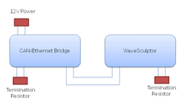

# PC Software

## Ethernet Bridge Installation

Refer to the [CAN-Ethernet bridge User's Manual](http://localhost:4000/CAN_Bus_To_Ethernet_Bridge/CAN-Ethernet_Bridge_User_Manual/Overview.md) for installation and setup of this piece of hardware.

Connect the Ethernet bridge via a CAN bus cable to the WaveSculptor.  Use 120 ohm termination resistors between the CAN-H and CAN-L lines at both items.

## PC Software

Refer to the [Software Download section on the WaveSculptor 22 product page]() for the Configuration & Setup software tool download.

Refer to the [Software User's Manual](http://localhost:4000/WaveSculptor_Motor_Controllers/WaveSculptor_Config_Software_User_Manual/Overview.md) for installation and usage instructions.

## Low Voltage & CAN Bus Testing

Provide 12V DC to the CAN bus adapter at the CAN-Ethernet Bridge, to power up both the Ethernet Bridge and the WaveSculptor control electronics.  

If everything is connected correctly, you should see telemetry values appearing and updating several times per second in the PC software window.

