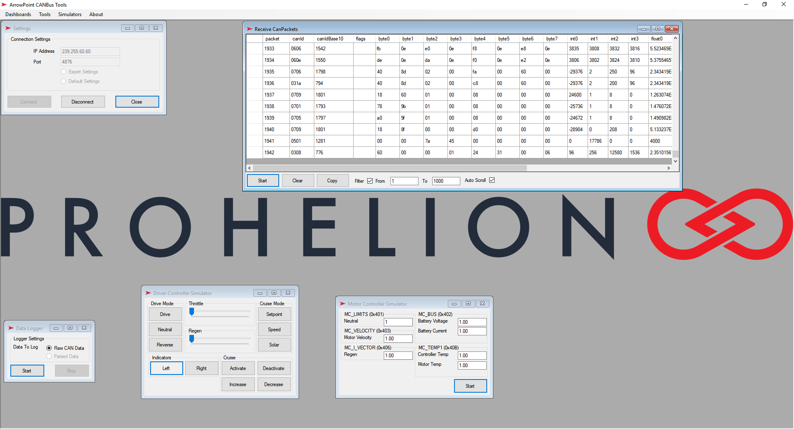

## Installation
Installation of the ArrowPoint-CAN Bus tools can be achieved simply by running the ArrowPointDiagnosticTool.exe in the following directory: 

\ArrowWareDiagnosticTool\bin\Debug 

or 

\ArrowWareDiagnosticTool\bin\Run directories

## Usage
The tool is relatively simple to use. Log in and connect to the CAN Bus network, typically the default settings will work fine.

You can then access a range of tools on the menu for logging / recording or replaying CAN Bus traffic as well as sending and simulating data in the system.

