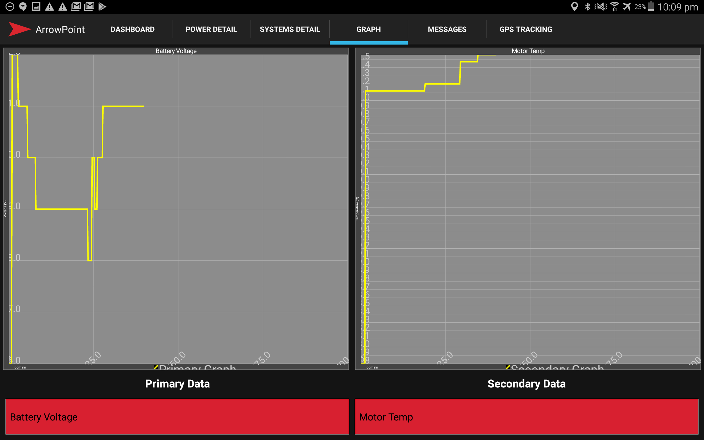

## Graphing
The graphing dashboard allows you to do basic graphing of key attributes on the tablet, this is generally useful when team members want to know something but do not want to be bothering the strategy or telemetry teams.

Because the ArrowPoint Telemetry application is written to be mobile friendly, if a team member needs more information they can also use their phone or tablet to log in to the [Telemetry Reporting](../ArrowPoint_Telemetry/30_Reporting.md) or use the [Integration with Splunk](../ArrowPoint_Telemetry/65_Splunk.md) to do more complex reporting.

