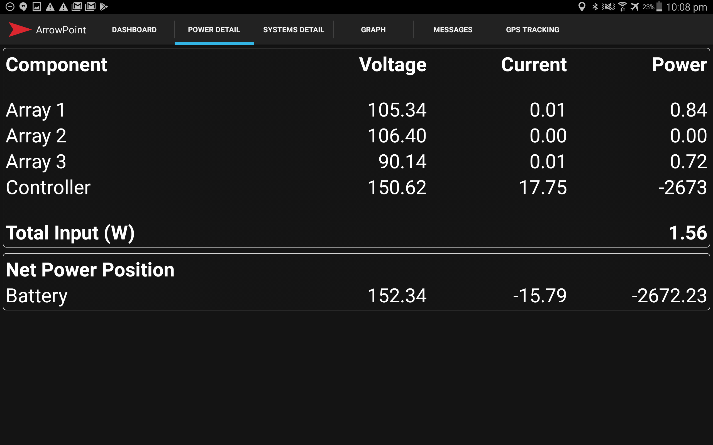

## Solar
The solar energy dashboard show the current performance of the solar array as well as the net power position to the battery.

In the example below the array is currently generating almost no power as there is a Total Input (W) of 1.56w (probably not a great example sorry!) and the controller is consuming 2673w, hence the current net power position on the car is -2672w.

