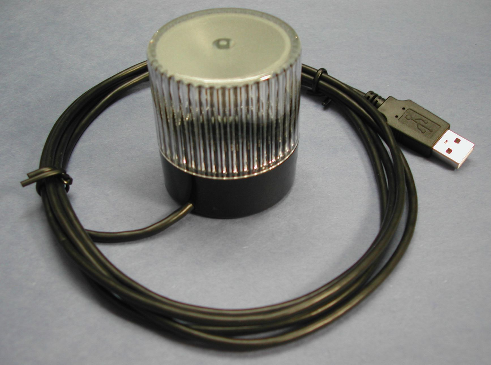

## Alerting

The Telemetry system has the ability to be connected to an external light that can alert you when CANbas based items go out of range.

Alerting is done via a visual cue using USB HID Visual Signal Indicators from Delcom Products

[https://www.delcomproducts.com/productdetails.asp?PartNumber=904007](https://www.delcomproducts.com/productdetails.asp?PartNumber=904007)

| Device        | Measurement               | CanId | dataPointCanId    | Warning Threshold | Alert Threshold   | Shutdown Threshold    | Alert Type    |
| BMS           | Min Cell Voltage          | 6F80  | 28544             | 2900              | 2750              | 2600                  | Low           |
| BMS           | Max Cell Temp             | 6F92  | 28562             | 500               | 550               | 600                   | High          |
| BMS           | CMU 1 PCB Temp            | 6014  | 24596             | 750               | 800               | 850                   | High          |
| BMS           | CMU 2 PCB Temp            | 6044  | 24644             | 750               | 800               | 850                   | High          |
| BMS           | CMU 3 PCB Temp            | 6074  | 24692             | 750               | 800               | 850                   | High          |
| BMS           | CMU 4 PCB Temp            | 60A4  | 24740             | 750               | 800               | 850                   | High          |
| BMS           | CMU 5 PCB Temp            | 60D4  | 24788             | 750               | 800               | 850                   | High          |
| BMS           | Overvoltage               | 6F82  | 28546             | 4100              | 4150              | 4200                  | High          |
| WaveSculptor  | Motor Temp                | 40B0  | 16560             | 90                | 100               | 120                   | High          |
| WaveSculptor  | Heatsink Temp             | 40B4  | 16564             | 60                | 65                | 80                    | High          |
| WaveSculptor  | DSP Operating Temp        | 40C0  | 16576             | 80                | 90                | 100                   | High          |
| Arrays        | Array 1 Power             | 3410  | 13328             | 0.1               | 1.2               | 1.2                   | Percentage    |
| Arrays        | Array 2 Power             | 3420  | 13344             | 0.1               | 1.2               | 1.2                   | Percentage    |
| Arrays        | Array 3 Power             | 3430  | 13360             | 0.1               | 1.2               | 1.2                   | Percentage    |
| Arrays        | Total Array Power         | 3440  | 13376             | 100               | 10                | 0                     | Low           |
| BMS-DC_DC     | BMS-DC_DC Max Cell Temp   | 1030  | 4144              | 50                | 55                | 60                    | High          |
| BMS-DC_DC     | Min Cell 1 Voltage        | 1040  | 4160              | 2900              | 2750              | 2600                  | Low           |
| BMS-DC_DC     | Min Cell 2 Voltage        | 1042  | 4162              | 2900              | 2750              | 2600                  | Low           |
| BMS-DC_DC     | Min Cell 3 Voltage        | 1044  | 4164              | 2900              | 2750              | 2600                  | Low           |
| BMS-DC_DC     | Min Cell 4 Voltage        | 1046  | 4166              | 2900              | 2750              | 2600                  | Low           |
| BMS-DC_DC     | Max Cell 1 Voltage        | 1040  | 4160              | 4100              | 4150              | 4200                  | High          |
| BMS-DC_DC     | Max Cell 2 Voltage        | 1042  | 4162              | 4100              | 4150              | 4200                  | High          |
| BMS-DC_DC     | Max Cell 3 Voltage        | 1044  | 4164              | 4100              | 4150              | 4200                  | High          |
| BMS-DC_DC     | Max Cell 4 Voltage        | 1046  | 4166              | 4100              | 4150              | 4200                  | High          |

Each CanId is set a range of values which if exceeded trigger a visual alert to notify the chase car that there are systems moving out of range. The system can look for values that are high or low.

For example if

* BMS-DC_DC Max Cell 4 Voltage goes beyond 4100 mv or 4.1 volts then the light will change colour from green to orange

* If the total array power drops below 100w the system will start to throw warnings

