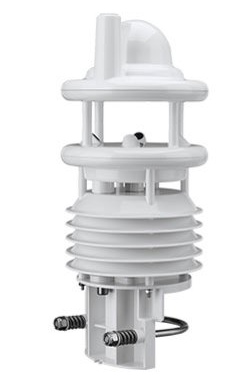
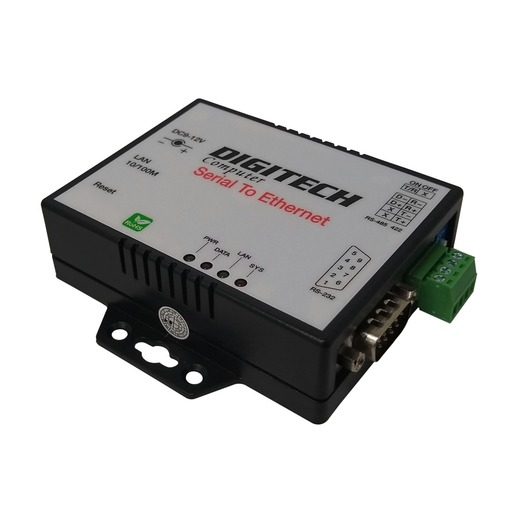

## Weather Integration

The Telemetry system can connect to weather stations to collect information in real time on the weather including wind speeds and solar irradiance. We use and recommend Lufft weather sensors such as the WS700-UMB, which are mounted on pole on top of the chase car. These devices can monitor wind speeds as well as solar radiation levels, air temperatures and humidity.

[https://www.lufft.com/products/compact-weather-sensors-293/ws700-umb-smart-weather-sensor-1830/](https://www.lufft.com/products/compact-weather-sensors-293/ws700-umb-smart-weather-sensor-1830/)

<figure markdown>

<figcaption>Smart Weather Sensor</figcaption>
</figure>

Lufft sensors are connected to the Telemetry system via a Serial to Ethernet bridge such as this one

[https://www.jaycar.com.au/serial-to-ethernet-converter/p/XC4134](https://www.jaycar.com.au/serial-to-ethernet-converter/p/XC4134)

<figure markdown>

<figcaption>Serial to Ethernet Converter</figcaption>
</figure>

The telemetry system then uses telnet to poll the device at regular intervals and extract the current weather data. That information is then broadcast on the network as CAN Bus packets for other devices to receive.

