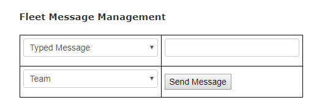

Under the Fleet Management menu item in the Telemetry system you will find a Fleet Message Management box.  From here you can chose to send private messages via the Wifi network to other vehicles in the fleet.

<figure markdown>

<figcaption>Example of the Fleet Messaging system</figcaption>
</figure>

This system works with the [ArrowPoint Tablet application](../ArrowPoint_Tablet/index.md), allowing messages to be sent to Tablets in the fleet.  Messages are sent via CAN Bus.

