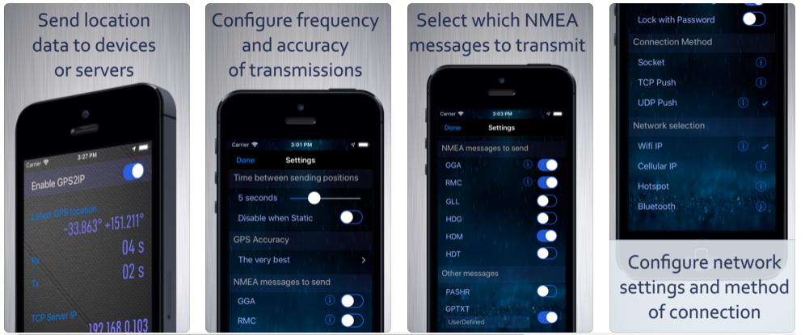
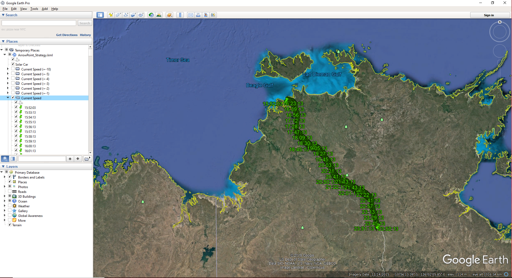

The Telemetry system can track your current location which can then be displayed on Google Maps.

We us the iPhone app GPS2IP to capture the GPS data and push it to the telemetry system

[https://apps.apple.com/us/app/gps-2-ip/id408625926](https://apps.apple.com/us/app/gps-2-ip/id408625926)

<figure markdown>

<figcaption>Iphone GPS Coordinate example</figcaption>
</figure>

The reason we use an iPhone app is simply redundancy and ease of development. The iPhone is typically mounted on the dash of the chase car and connected to the in car Wifi network. It captures GPS data and then transmits it to the Telemetry application which is listening on a socket for the GPS data. The Telemetry application then broadcasts the GPS data as CAN Bus packets for other devices to receive.

The Telemetry system integrates with Google Earth to allow you to visualize your strategy and plan landing spots later in the day. For this feature to work you need to have Google Earth installed and then go to the Fleet Management page in the telemetry system 

```
http://localhost:9000/fleet.html
```

and click the strategy speed predictions link. The system will then produce a KML file and Google Earth (or whatever KML visualization tool you use will load).

<figure markdown>

<figcaption>Example of the Google Earth Pro interface</figcaption>
</figure>

Selecting current speed on the menu shows where the car will be on the road using your current speed. By selecting current speed (+1) you will see where you will be if you were to go 1kph faster etc.

When GPS Integration is enabled, the car itself will appear on the map showing your current location.

However, as the vehicle is not currently on the route, it’s not showing in the image above.