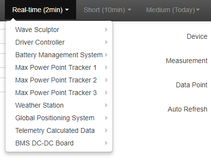

## Reporting

The telemetry system allows you to do basic reporting by selecting the device that you want to report on off the menu

Note that for more advanced reporting we would suggest using the [Integration with Splunk](Splunk.md) which allows you to do very complex and rich reporting.

 
