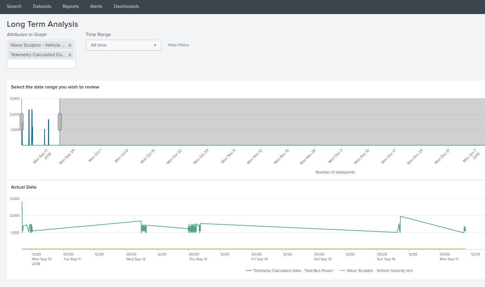

If enabled in the Configuration the Telemetry system will send data to splunk for reporting and management. From here you can undertake complex data analysis using tools like the Long Term Analysis tool, which allows you to view any data points across any time range

<figure markdown>

<figcaption>Example of the ArrowPoint Dashboard</figcaption>
</figure>

Splunk is a commercial product and typically requires a commercial license for larger data sets. TeamArrow applied for the [Splunk 4 Good program](https://www.splunk.com/), which provided free Splunk licenses to organisations that are seeing to do non commercial based activities, contact Splunk for more information.