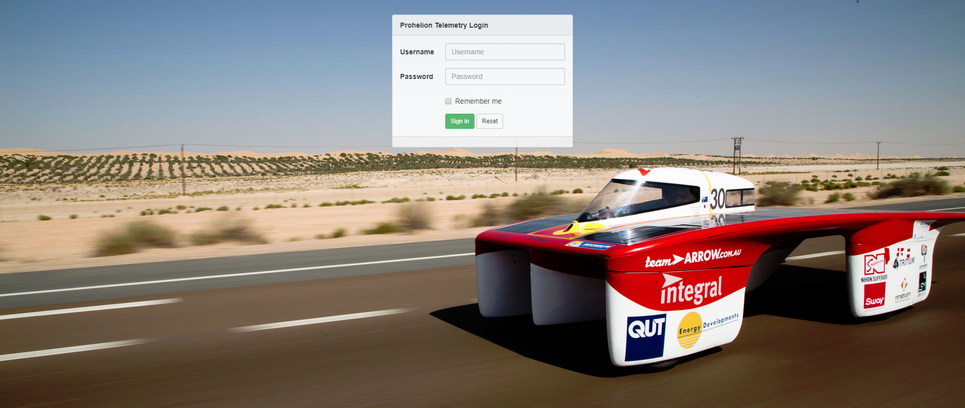
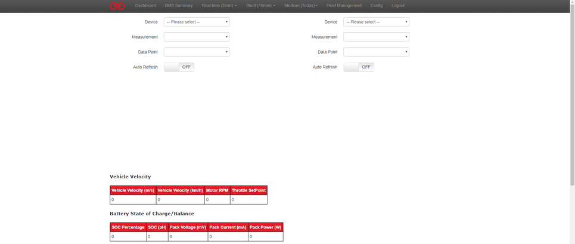
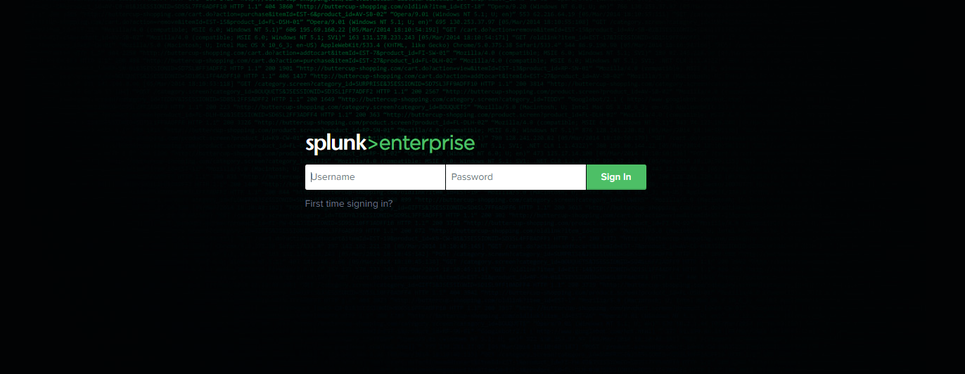
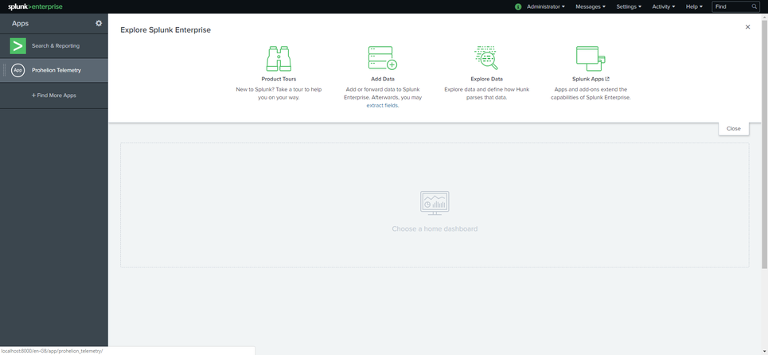
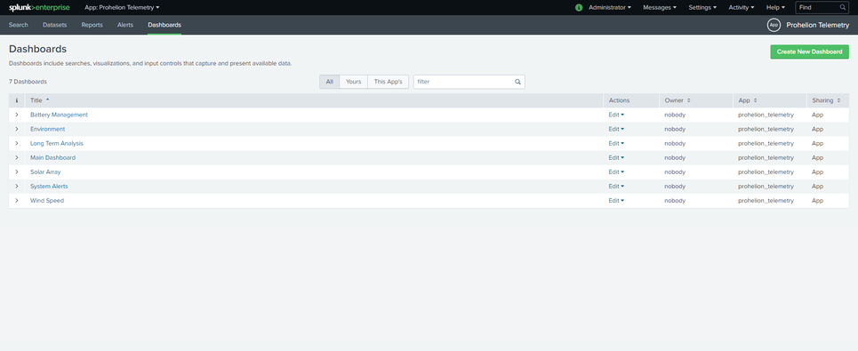
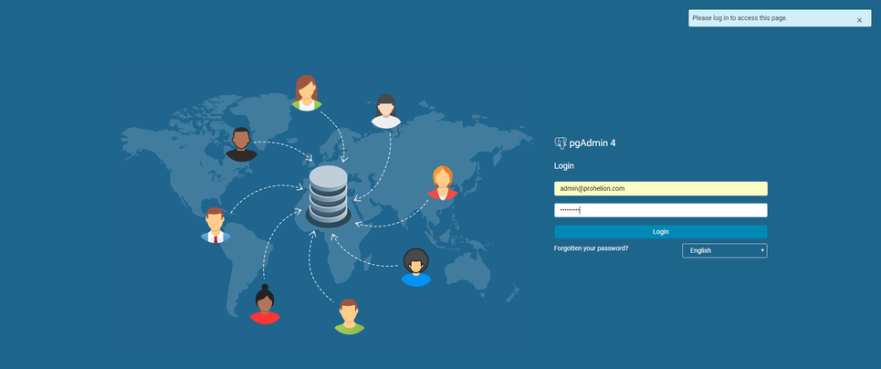
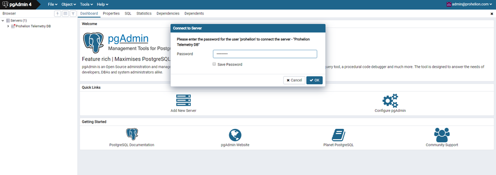

The core telemetry system can be accessed by going to 

```
http://localhost:9000
```

If the system is running you will see a page that looks like this.

<figure markdown>

<figcaption>Telemetry Login</figcaption>
</figure>

If you see the screen then you will able to log in with the default account

**Username**: admin

**Password**: passw0rd!

At which point you should be presented with the dashboard that looks like this.

<figure markdown>

<figcaption>Telemetry Dashboard</figcaption>
</figure>

## Splunk 
Complex reporting is handled in the Telemetry system by splunk, which can be accessed by going to the url 

```
http://localhost:8000
```

If everything is running correctly, you should see a screen that looks like this

<figure markdown>

<figcaption>Splunk Login</figcaption>
</figure>

If you see the screen then you will able to log in with the default account

**Username**: admin

**Password**: passw0rd!

<figure markdown>

<figcaption>Splunk Dashboard</figcaption>
</figure>

Click on the Prohelion Telemetry Application and then the Dashboards menu item to see that available reporting dashboards

<figure markdown>

<figcaption>Splunk Report</figcaption>
</figure>

## PgAdmin 
PgAdmin allows you direct access to the underlying TimescaleDB (Postgres) database that runs the Telemetry System. You can access it on the URL 

```
http://localhost:5080
```

Click the menu on the left to display the available connections and then use the default accounts to connect to the database.

**Username**: admin@prohelion.com

**Password**: passw0rd!

<figure markdown>

<figcaption>PgAdmin Login</figcaption>
</figure>

Once you have logged in, connect to the database instance in the menu on the left and reenter the database password.

**Password**: passw0rd!

<figure markdown>

<figcaption>PgAdmin Database</figcaption>
</figure>

You are now connected to the database instance, the tables for the application are stored in the public schema.