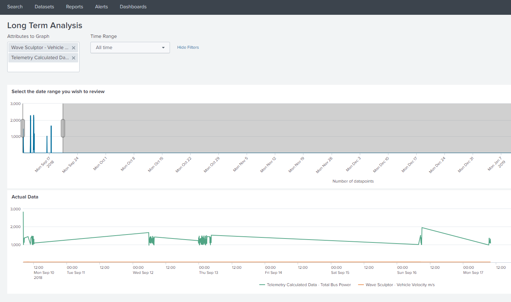

The ArrowPoint Telemetry Solution is designed to provide telemetry capture and management information for managing a race car.

The out of the box implementation is designed for use in Solar or Electric racing cars that use technology from [Prohelion](https://www.prohelion.com/) or [Tritium](https://www.tritiumcharging.com/). This solution was originally developed by [TeamArrow](https://www.teamarrow.com.au/) and has been used in racing environments since 2013. TeamArrow continue to use this application as the heart of its telemetry and strategy management solutions.

The solution captures and stores all telemetry data in a race environment and has been used to capture over 60,000,000 data points in previous events and testing and can manage, track and store around 400 data points a second when running on a i7 laptop. It provides reporting (via [Splunk](https://www.splunk.com/)) across full data sets via a web interface and allows teams to build and track massive data sets via dashboards and dynamically modifiable searches.

<figure markdown>

<figcaption>Example of the ArrowPoint Dashboard</figcaption>
</figure>

The ArrowPoint-Telemetry system is very light weight (considering what it is doing!) and [TeamArrow](https://www.teamarrow.com.au/) have historically run it on a single CPU laptop, which we tuck on the seat in the chase car or can be run in the cloud (we use Amazon EC2) when coupled with the ArrowPoint-Tablet for data relay.

Examples of the software in use can be seen here - [https://www.youtube.com/watch?reload=9&v=lWkXEb8v1tk](https://www.youtube.com/watch?reload=9&v=lWkXEb8v1tk)

## Features

For the full feature list see the Telemetry System Features section, but at a high level the application provides

* CAN Bus data capture and reporting either directly off the car, via the ArrowPoint-Tablet or a JSON stream
* Alerting via a visual signals (USB light), when key data points go out of range
* Storage of CAN Bus data in a relational data set for later reporting against very large datasets
* Relaying of data to other ArrowPoint-Telemetry instances
* Integration with SPLUNK for larger scale data capture and real time reporting
* Mechanisms to visualise your position and strategy in Google Earth

The application is compatible with

* Prohelion Battery Packs
* Prohelion and Tritium WaveSculptors
* Prohelion and Tritium BMUs and CMUs

Any issues please or question, please raise them on our GitHub account at [https://github.com/Prohelion/ArrowPoint-Telemetry](https://github.com/Prohelion/ArrowPoint-Telemetry) or see the [Software Troubleshooting page](../Troubleshooting.md).

