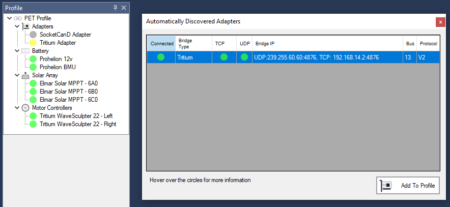
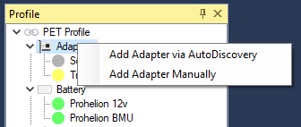

# CAN Bus Adapters

An adapter is the technology that you use to connect Profinity to your CAN Bus network.  

Profinity on Windows supported adapters include the [Prohelion](https://www.prohelion.com) and Tritium CAN Bus bridges as well as SocketCAN using the [SocketCanD](https://github.com/linux-can/socketcand) technology and the [Peak CAN to USB Adapter](https://www.peak-system.com/PCAN-USB.199.0.md?&L=1).

!!! info "When running the Peak CAN to USB Adapter"
    It is necessary to install the driver for the device before starting Profinity.  Use the supplied Peak tools to ensure your adapter is working as expected before starting Profinity and then AutoDiscovered the adapter as per normal

When running Profinity on [Docker or Linux](60_Profinity_Server.md) additional support is also provided for the native SocketCAN Adapter.

Adapters can be added in one of two ways, either via Auto Discovery or Manually.

## Adapter Auto Discovery

The supported CAN Bus adapters can be automatically found via the Auto Discovery mechanism.  If an adapter is defined and visible on the network then clicking the CAN Adapters button on the menu or right clicking on the Profile and selecting 'Add Adapter Via Autodiscovery' will work.

In the Autodiscovery window you will find all of the adapters that are currently visible to Profinity.  If your adapter does not show up here then you may have configuration issues that need to be addressed.

!!! info "Having trouble finding a CAN over Ethernet Bridge with Autodiscovery?"
    The CAN over Ethernet Bridges have a number of configuration options and at times may not behave as expected.  Check out our guide on the [CAN to Ethernet Bridges](../FAQs/CAN_bus_Adapters/Tritum_CAN_Ethernet_Bridge/index.md) for tips and tricks on getting them working.

## Adapter Manual Configuration

## Adapter Status

Once your adapter has been added to the Profile then the colour of the circle indicates the health of the adapter.  Ideally your adapter should have a green circle, the colour signals for the adapters are as follows;

| Colour   | Meaning                                               |
| -------- | ----------------------------------------------------- |
| `Green`  | Good, adapter is connected and we are getting data    |
| `Yellow` | Warning, adapter is connected but no data is arriving |
| `Red`    | Error, see the logs for more details                  | 
| `Grey`   | N/A, adapter is not connected                         |