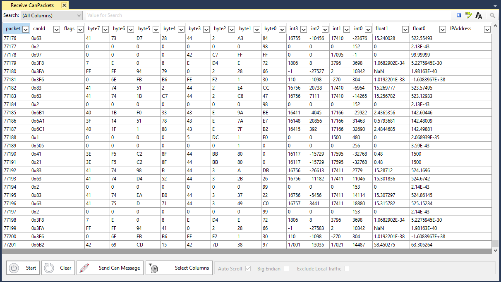
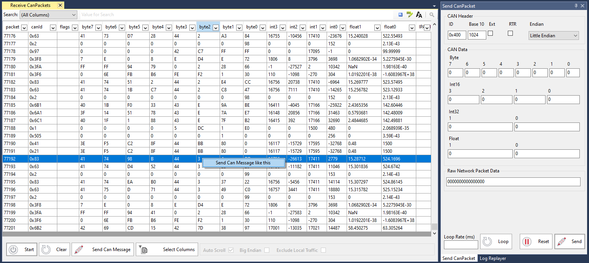
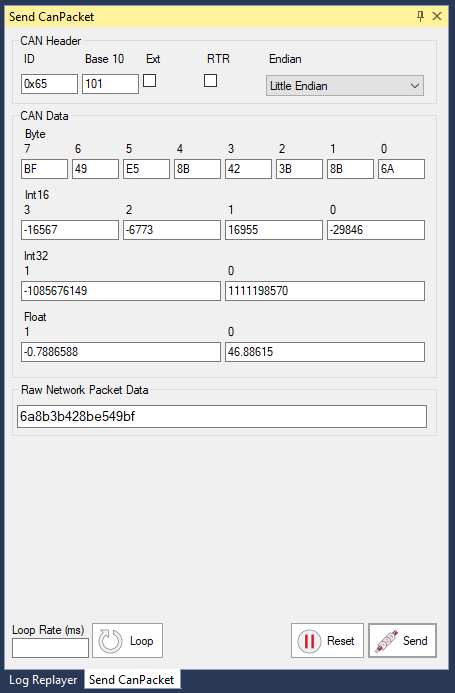

# Send / Receiving CAN Bus Messages

Profinity can monitor CAN Bus traffic on your network and also allows you to transmit message back on the CAN network from within the Profinity toolset.

Messages can be transmitted either via the Send CAN window which is documented below or also via the [CAN Replay](60_Logging_Replaying_CAN_Bus_Messages.md) tool.

## Receive CAN Packets

Click on the Receive CAN Packets menu item to see a view of all the CAN Bus messages currently travelling across your network.

The options at the bottom of this window allow you to filter the messages by CAN ID and change various other settings like the Endian representation of the message (Big Endian vs Little Endian) and exclude local traffic (traffic from Profinity) if the adapter supports that (not all adapters support local filtering).

## Send CAN Message like this

Right mouse clicking on a line allows you to select an option to 'Send Can Message like this', clicking this option will open the Send CAN Packet window and pre-populate it with the data from the message that you have received.

## Send CAN Packet

The Send CAN Packet window allows you to transmit messages back on to the CAN Bus Network from Profinity.  From this tool you can set the CAN ID, endian as well as the values for either Bytes, Int16, Int32, Floats or the raw packet data.

When you change one of these values the raw data updates to reflect that.  Likewise when you change the raw data the values update to reflect that change.

Using the loop option will send your CAN packet at your chosen loop rate, so 100 send the packet every 100ms or ten times a second.

Note that as Profinity is currently a Windows only tool, the default byte order used is little endian to align with Windows / Intel.  Little endian is also used by most of the Prohelion technologies.

