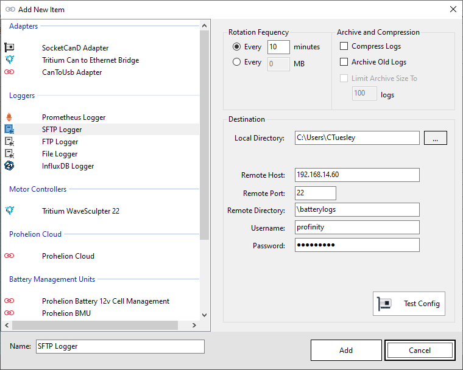
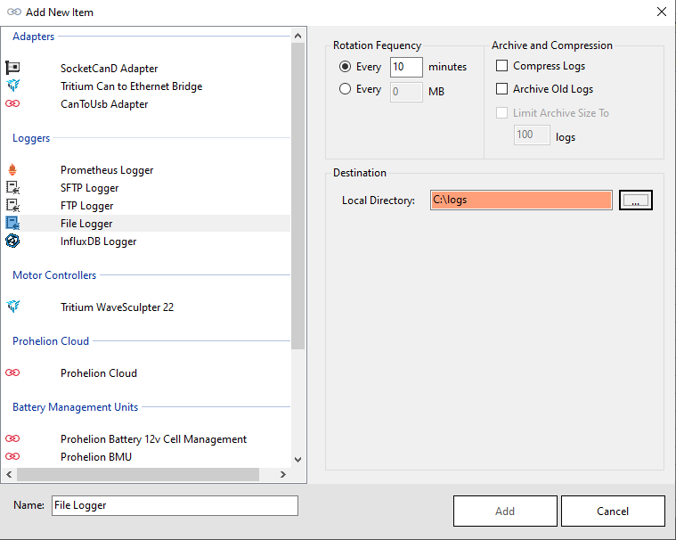
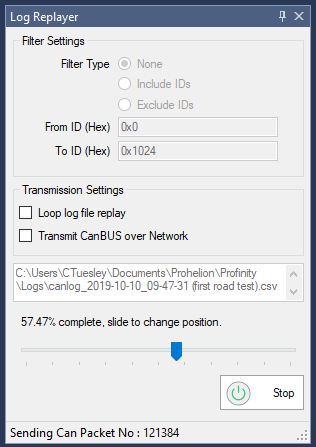

# Log / Replay CAN Bus Messages

Profinity provides the ability to both log and replay messages off your CAN Bus network as well as the ability to log CanBUS data to timeseries databases like InfluxDB and Prometheus.  

To log a set of CAN Bus messages first add an adapter to your [Profile](10_Profiles.md) and then connect to the adapter.  

It's always worth checking that you are actually receiving CAN Bus messages by using the [Receive CAN Bus](50_Send_Receive_CAN_Bus_Messages.md) window first.  Once you have got CAN Bus messages coming in to Profinity you are read to log.

## Logging CAN Bus

There are two distinct types of loggers available in Profinity, loggers to log to file and loggers that log to timeseries databases such as [InfluxDB and Prometheus](80_InfluxDB_Prometheus_Integration.md).

All loggers are configured in the same manner, by adding a logging device to the Profile.

## File / FTP / SFTP Based Loggers

File based loggers in Profinity have three potential modes of operation, you can either

| Log Mode              | Details                                                                             |
| --------------------- | ----------------------------------------------------------------------------------- |
| Log Locally to Disk   | Writes the log files to your local file system.                                     |
| Log Remotely via FTP  | As well as logging locally this option takes the log file and places it on a remote FTP server for off site analysis.        |
| Log Remotely via SFTP | As per FTP, but this time a Secure FTP (SFTP) end point is used as the destination. | 

Depending on the item you select, Profinity will present you with different destination options.  For FTP and SFTP it is necessary to provide the destination server, username and password.  For local logging only a directory is required.

The logger also gives you the ability to manage Archive and Compression settings, if you wish to archive your messages you must provide an archive directory.

| Setting               | Purpose                                           |
| --------------------- | ------------------------------------------------- |
| Compress Logs         | Once a log file has reached the size limit, then it is compressed.
| Archive Old Logs      | Older log files are rotated to an archive directory based on a rotation policy |
| Limit Archive Size To | Maintains a maximum number of log files at this number, older logs are deleted |

Finally the logger allows you to set the frequency of rotation.  Rotation means that the old log file is closed and a new one is created and Profinity allows you to define a minute based log rotation or a size base log rotation depending on your preference.

Logging configurations are stored as part of your profile so when you load a profile, if you have the logger setup to automatically start then it will start logging automatically.

### Data Validation

Profinity uses data entry validation to ensure the information you provide is valid.  

When an invalid value is entered in this screen the field will turn to an orange colour, indicating an issue.  If the field is white then the data is fine.

## Data Log Replayer

The Profinity data log replayer allows you to replay log files that have previously been recorded in Profinity.

To use this tool simply select the log file and it will start replaying.  There are also a number of options available that can change the way the log file is replayed.

| Setting               | Purpose                                           |
| --------------------- | ------------------------------------------------- |
| Include / Exclude IDs | Instruct the log replayer to only include or exclude values between these two CAN Bus IDs |
| Loop log file replay  | When the log file reaches the end, automatically loop back to the start |
| Transmit CAN Bus over Network | Normally the log file is only replayed locally, by selecting the Transmit option the log file is transmitted over any active CAN-Ethernet Bridges |

Sliding the slider back and forth allows you to easily move to new locations in the CAN Bus replay file.

## Time Series Based Loggers

Profinity supports two time series databases for logging, InfluxDB and Prometheus.  For more information on setting up theses tools see the [InfluxDB and Prometheus documentation](80_InfluxDB_Prometheus_Integration.md).