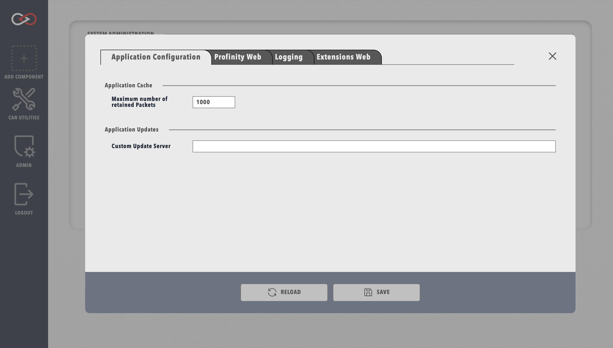

# System Configuration

The `System Configuration` menu is located in the `ADMIN` tab and contains <!-- FINISH -->. Information about the `Logging` menu is in the [Logs section](logs_config.md#system-logs-configuration).

!!! warning "Changes to the system config"
    Modifying any parameters in the `System Configuration` menu will trigger a reboot of Profinity. If using the web client, wait around 15 seconds after saving the changes before reloading the page.

### Application Configuration

| Parameter                          |  |
|------------------------------------|--|
|`Custom Update Server`              |  |
|`Maximum number of retained Packets`|  |
|`Enable Scripting`                  |  |

<figure markdown>

<figcaption>Application configuration menu</figcaption>
</figure>

### Profinity Web

| Parameter                          |  |
|------------------------------------|--|
|`IP Address for Http`               |  |
|`IP Port for Http`                  |  |
|`IP Address for Https`              |  |
|`IP Port for Https`                 |  |
|`Redirect all Http traffic to Https`|  |
|`Windows Cert Store`                |  |
|`Windows Cert Store Location`       |  |
|`Windows Cert Store Subject`        |  |
|`Cert File`                         |  |
|`Cert File Password`                |  |

<figure markdown>

<figcaption>Profinity web menu</figcaption>
</figure>

### Extensions Web

| Parameter                          |  |
|------------------------------------|--|
|`Enable Profinity Web Server`       |  |
|`Enable Profinity API`              |  |
|`Enable Swagger on API`             |  |
|`IP Address for Http`               |  |
|`IP Port for Http`                  |  |
|`IP Address for Https`              |  |
|`IP Port for Https`                 |  |
|`Redirect all Http traffic to Https`|  |
|`Windows Cert Store`                |  |
|`Windows Cert Store Location`       |  |
|`Windows Cert Store Subject`        |  |
|`Cert File`                         |  |
|`Cert File Password`                |  |

<figure markdown>

<figcaption>Extensions web menu</figcaption>
</figure>
