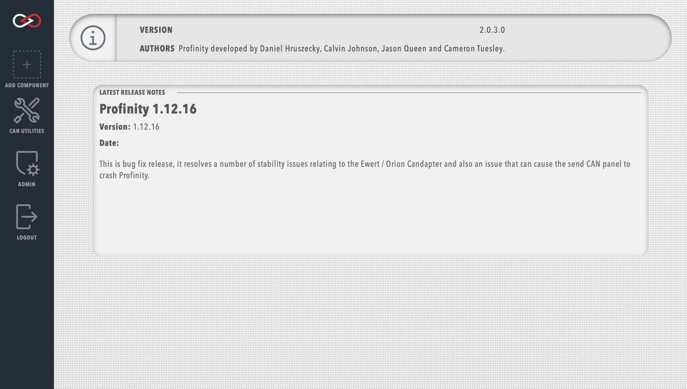

# System Information

To see which version of Profinity you are running, select the `System Information` option in the `ADMIN` tab.

<figure markdown>

<figcaption>System information page</figcaption>
</figure>

This page also contains notes about the latest Profinity releases and the software credits.