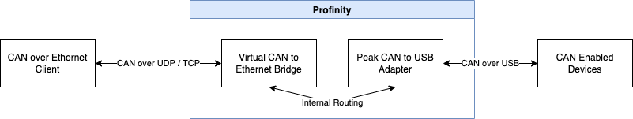
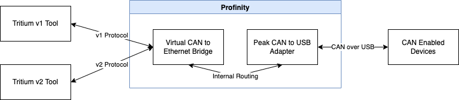
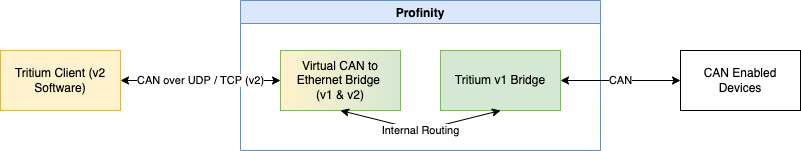
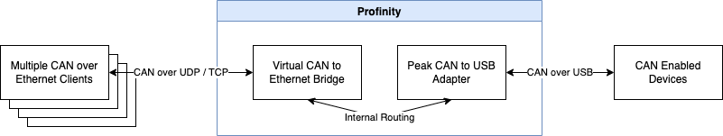

# CAN Bus Adapters

An adapter is the technology that you use to connect Profinity to your CAN Bus network.  

Profinity on Windows supported adapters include the [Prohelion](https://www.prohelion.com) and Tritium CAN Bus bridges as well as SocketCAN using the [SocketCanD](https://github.com/linux-can/socketcand) technology and the [Peak CAN to USB Adapter](https://www.peak-system.com/PCAN-USB.199.0.html?&L=1).

!!! info "When running the Peak CAN to USB Adapter"
    It is necessary to install the driver for the device before starting Profinity.  Use the supplied Peak tools to ensure your adapter is working as expected before starting Profinity and then AutoDiscovered the adapter as per normal

When running Profinity on [Docker or Linux](Profinity_Server.md) additional support is also provided for the native SocketCAN Adapter.

Adapters can be added in one of two ways, either via Auto Discovery or Manually.

## Adapter Auto Discovery

The supported CAN Bus adapters can be automatically found via the Auto Discovery mechanism.  If an adapter is defined and visible on the network then clicking the CAN Adapters button on the menu or right clicking on the Profile and selecting 'Add Adapter Via Autodiscovery' will work.

In the Autodiscovery window you will find all of the adapters that are currently visible to Profinity.  If your adapter does not show up here then you may have configuration issues that need to be addressed.

<figure markdown>

<figcaption>Add an Adapter via AutoDiscovery</figcaption>
</figure>

!!! info "Having trouble finding a CAN over Ethernet Bridge with Autodiscovery?"
    The CAN over Ethernet Bridges have a number of configuration options and at times may not behave as expected.  Check out our guide on the [CAN to Ethernet Bridges](../FAQs/CAN_bus_Adapters/CAN_Ethernet_Bridge/index.md) for tips and tricks on getting them working.

## Adapter Manual Configuration

<figure markdown>

<figcaption>Add an Adapter</figcaption>
</figure>

!!! info "CAN bus bitrate"
    In order for all of the devices on your CAN bus to communicate, they must all be operating at the same bitrate, including the CAN bus adaptor that connects Profinity to your CAN bus. Some devices allow you to configure the bitrate (can be done through the component configuration menus), but some devices only offer a specific bitrate that will put constraints on the other devices in the network. This should be a consideration when designing your system.

## Adapter Status

Once your adapter has been added to the Profile then the colour of the circle indicates the health of the adapter.  Ideally your adapter should have a green circle, the colour signals for the adapters are as follows;

| Colour   | Meaning                                               |
| -------- | ----------------------------------------------------- |
| `Green`  | Good, adapter is connected and we are getting data    |
| `Yellow` | Warning, adapter is connected but no data is arriving |
| `Red`    | Error, see the logs for more details                  | 
| `Grey`   | N/A, adapter is not connected                         |

## Prohelion Virtual CAN Bus Adapter

The Prohelion Virtual CAN Bus Adapter is a special type of adapter in Profinity in that it is designed to relay information to one or more another CAN adapters while presenting itself to other clients as a Tritium / Prohelion adapter that can be connected to.

In the diagram below, a client on the left connects to the Virtual Adapter which is being used in conjunction with a Peak USB adapter to provide connectivity to the actual CAN Network.  Traffic is routed bi-directionally.

<figure markdown>

<figcaption>Virtual Adapter</figcaption>
</figure>

The Virtual adapter serves an important role in helping tools that have previously been developed to support the Tritium and Prohelion CAN to Ethernet bridges work, in the absence of an actual physical bridge.  Instead, a different CAN connection technologies such as SocketCAN or the Peak USB adapter can be used to actually connect to the CAN network and the virtual bridge supports connectivity to the legacy technologies.

To add a Virtual Adapter to your configuration, simply add one to your Profile and select which Network Interface will be used along with the Bridge ID for your configuration.

!!! warning "Take care with your BridgeID"
    Having two bridges with the same ID on a single network causes the two bridges to start relaying data from one bridge to the other bridge.  This is a designed behaviour that allows to separate CAN Bus networks to be spanned over Ethernet.  Just be aware of it when using the Virtual Adapter, see the [CAN to Ethernet documentation](../CAN_Bridge/User_Manual/index.md)</a> for more information.

Generally, the configuration options for the Virtual Bridge are similar to that of the Tritium bridge.  

However, there are several key areas in which the virtual bridge behaves differently than the physical bridge and these are noted below.

### Multi-Protocol Support

Tritium and Prohelion CAN to Ethernet Bridges have been shipped in two versions that speak generally incompatible protocols v1 and v2.  More recent bridges were v2, but we still see lots of v1 bridges around from older customers. 

Tritium software tools where generally shipped in either a v1 or v2 variant to talk the correct protocol version, which means that a v1 Bridge, could not talk to a v2 version of the software.

The Virtual Bridge resolves this issue by speaking both the v1 and v2 protocol at the same time.  It does this by representing itself as two bridges one a v1 bridge and the other a v2.  The older tools will generally discover the version of the bridge that that can speak to.

<figure markdown>

<figcaption>Multi-Protocol Support</figcaption>
</figure>

One very useful scenario for the Virtual Bridge is to use it in conjunction with a physical v1 bridge to talk to tools that were designed for the v2 protocols.  

In the scenario below Tritium v1 Bridge is front ended by the Virtual adapter / router, allowing it to communicate with tools that support the v2 protocol.

<figure markdown>

<figcaption>v1 and v2 Protocol Support</figcaption>
</figure>

### Multi-Client TCP Support

The physical bridge can only handle a single client at a time in TCP mode.  The virtual bridge can handle multiple clients simultaneously.  This allows the virtual bridge to act as a form of TCP based CAN Bridge server, where many clients can connect at once over TCP and sustain the connection to get CAN data from this interface.  This may be a useful tool for people looking to establish real time CAN monitoring in remote locations.

<figure markdown>

<figcaption>Multi-Client Support</figcaption>
</figure>

### Features no longer available

As the Virtual CAN Bridge is running inside Profinity, the IP address of the adapter should be set at an OS level on that machine and cannot be changed remotely via the CAN Bridge Config tools or Profinity.