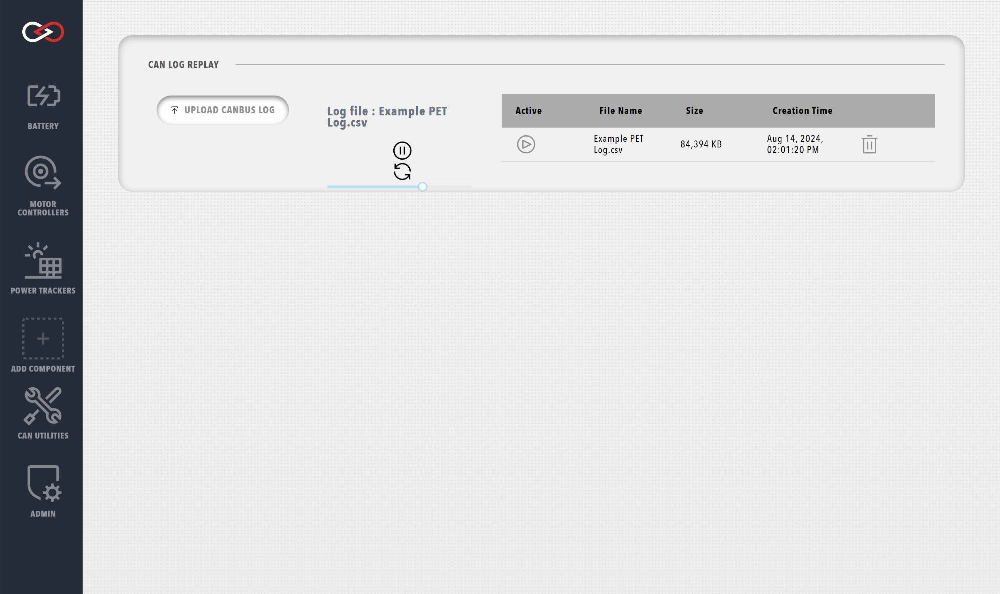
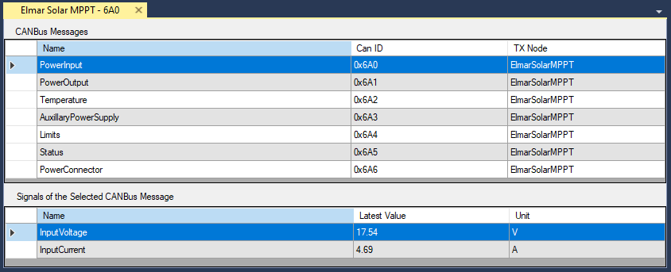

Profinity provides a number of in-built tools for testing, simulating, and debugging CAN networks and systems. Profinity's CAN tools can be accessed via the CAN Utilities tab in the sidebar.

## Send / Receiving CAN Bus Messages

Profinity can monitor CAN Bus traffic on your network and also allows you to transmit message back on the CAN network from within the Profinity toolset.

Messages can be transmitted either via the Send CAN window which is documented below or also via the [CAN Replay](#log--replay-can-bus-messages) tool.

!!! info "Check user privileges"
    Before trying to send or receive any CAN packets, ensure that the current user has the associated privilege enabled.

### Receive CAN Packets

Click on the Receive CAN Packets menu item to see a view of all the CAN Bus messages currently travelling across your network.

<figure markdown>

<figcaption>Receive CAN Packets</figcaption>
</figure>

The options at the bottom of this window allow you to filter the messages by CAN ID and change various other settings like the Endian representation of the message (Big Endian vs Little Endian) and exclude local traffic (traffic from Profinity) if the adapter supports that (not all adapters support local filtering).

### Send CAN Message like this

Right mouse clicking on a line allows you to select an option to 'Send Can Message like this', clicking this option will open the Send CAN Packet window and pre-populate it with the data from the message that you have received.

<figure markdown>

<figcaption>Send CAN Packet like this</figcaption>
</figure>

### Send CAN Packet

The Send CAN Packet window allows you to transmit messages back on to the CAN Bus Network from Profinity.  From this tool you can set the CAN ID, endian as well as the values for either Bytes, Int16, Int32, Floats or the raw packet data.

When you change one of these values the raw data updates to reflect that.  Likewise when you change the raw data the values update to reflect that change.

Using the loop option will send your CAN packet at your chosen loop rate, so 100 send the packet every 100ms or ten times a second.

Note that as Profinity is currently a Windows only tool, the default byte order used is little endian to align with Windows / Intel.  Little endian is also used by most of the Prohelion technologies.

## Log / Replay CAN Bus Messages

Profinity provides the ability to both log and replay messages off your CAN Bus network as well as the ability to log CanBUS data to timeseries databases like InfluxDB and Prometheus.  

To log a set of CAN Bus messages first add an adapter to your [Profile](Profiles.md) and then connect to the adapter.  

It's always worth checking that you are actually receiving CAN Bus messages by using the [Receive CAN Bus](#receive-can-packets) window first.  Once you have got CAN Bus messages coming in to Profinity you are read to log.

### Logging CAN Bus

There are two distinct types of loggers available in Profinity, loggers to log to file and loggers that log to timeseries databases such as [InfluxDB and Prometheus](InfluxDB_Prometheus_Integration.md).

All loggers are configured in the same manner, by adding a logging device to the Profile.

### File / FTP / SFTP Based Loggers

File based loggers in Profinity have three potential modes of operation, you can either

| Log Mode                | Details                                                                             |
|-------------------------|-------------------------------------------------------------------------------------|
| `Log Locally to Disk`   | Writes the log files to your local file system.                                     |
| `Log Remotely via FTP`  | As well as logging locally this option takes the log file and places it on a remote FTP server for off site analysis.                                                                                   |
| `Log Remotely via SFTP` | As per FTP, but this time a Secure FTP (SFTP) end point is used as the destination. | 

Depending on the item you select, Profinity will present you with different destination options.  For FTP and SFTP it is necessary to provide the destination server, username and password.  For local logging only a directory is required.

The logger also gives you the ability to manage Archive and Compression settings, if you wish to archive your messages you must provide an archive directory.

| Setting                 | Purpose                                                                        |
|-------------------------|--------------------------------------------------------------------------------|
| `Compress Logs`         | Once a log file has reached the size limit, then it is compressed.             |
| `Archive Old Logs`      | Older log files are rotated to an archive directory based on a rotation policy |
| `Limit Archive Size To` | Maintains a maximum number of log files at this number, older logs are deleted |

Finally the logger allows you to set the frequency of rotation.  Rotation means that the old log file is closed and a new one is created and Profinity allows you to define a minute based log rotation or a size base log rotation depending on your preference.

<figure markdown>

<figcaption>Data Logger</figcaption>
</figure>

Logging configurations are stored as part of your profile so when you load a profile, if you have the logger setup to automatically start then it will start logging automatically.

### Data Validation

Profinity uses data entry validation to ensure the information you provide is valid.  

When an invalid value is entered in this screen the field will turn to an orange colour, indicating an issue.  If the field is white then the data is fine.

<figure markdown>

<figcaption>Data Logger Error</figcaption>
</figure>

### Data Log Replayer

The Profinity data log replayer allows you to replay log files that have previously been recorded in Profinity.

To use this tool simply select the log file and it will start replaying.  There are also a number of options available that can change the way the log file is replayed.

| Setting                         | Purpose                      |
|---------------------------------|------------------------------|
| `Include / Exclude IDs`         | Instruct the log replayer to only include or exclude values between these two CAN Bus IDs                                                          |
| `Loop log file replay`          | When the log file reaches the end, automatically loop back to the start                                                            |
| `Transmit CAN Bus over Network` | Normally the log file is only replayed locally, by selecting the Transmit option the log file is transmitted over any active CAN-Ethernet Bridges |

Sliding the slider back and forth allows you to easily move to new locations in the CAN Bus replay file.

<figure markdown>

<figcaption>Data Log Replayer</figcaption>
</figure>

### Time Series Based Loggers

Profinity supports two time series databases for logging, InfluxDB and Prometheus.  For more information on setting up theses tools see the [InfluxDB and Prometheus documentation](InfluxDB_Prometheus_Integration.md).

## CAN Bus DBC

[DBC](http://socialledge.com/sjsu/index.php/DBC_Format) is a file format that can be used to describe the format and nature of CAN Bus data.  With a DBC file CAN data can be understood more clearly and broken down in to Signals and Messages, the fundamental building blocks of a DBC file.

For the moment, Profinity provides a DBC Viewer that can be used to take a DBC file and will show the CAN Bus traffic travelling through the Profinity system as Messages and Signals.

<figure markdown>

<figcaption>CAN DBC Viewer</figcaption>
</figure>

To use the DBC viewer with a third party DBC file you need to [create a new item](Adding_New_Items.md) in your [Profile](Profiles.md) and in the configuration properties for that new item provide the DBC file.  

Once this has been done then you will see the item in your profile and by right mouse clicking on it you can access information about its Messages and Signals.

Many of the other components supported by Profinity such as the [Elmar Solar MPPT](Elmar_Solar_MPPT.md) and the [WaveSculptor](WaveSculptor.md) have support for DBC built in to the component and also allow you to view Messages and Signals, without requiring a separate DBC file.