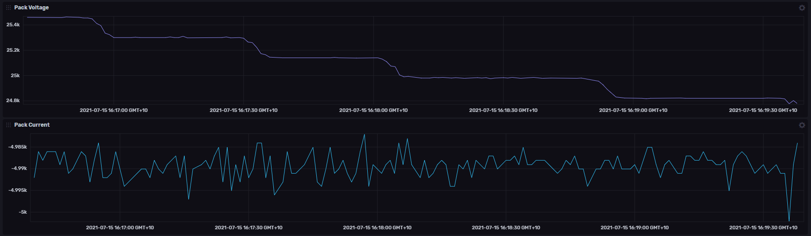

# InfluxDB and Prometheus Logging

Profinity provides the ability to both [log and replay messages](../../CAN_Utilities/Logging_Replaying_CAN_Bus_Messages.md) off your CAN Bus network as well as the ability to log CAN Bus data to timeseries databases like InfluxDB and Prometheus.

<figure markdown>

<figcaption>Data Log Replayer</figcaption>
</figure>

[InfluxDB](https://www.influxdata.com) is an all in one solution with data storage and visualisation included in a single tool.  [Prometheus](https://prometheus.io) just provides data storage and is typically coupled with [Grafana](https://grafana.com) for visualisation.  

All of these tools are available in commercially supported and Open Source (community supported) editions.

## InfluxDB

To log your CAN Bus data to [InfluxDB](https://www.influxdata.com/) v1 or v2 firstly install InfluxDB and get it up and running.

!!! warning "InfluxDB Versions are Important"
    Make sure you are using the right version of the InfluxDB Logger as Profinity's v1 and v2 logger support Influx v1 and v2 which use different protocols.

Logging the data is simple, just add a InfluxDB device to your profile and configure the following options. 

| Setting               | Purpose                                                               |
| --------------------- | --------------------------------------------------------------------- |
| InfluxDB Bucket       | What InfluxDB bucket do you want to store your data in?               |
| InfluxDB Organisation | What InfluxDB organisation do you want to use?                        |
| InfluxDB Token        | Security token for the user you are connecting to InfluxDB as         |
| InfluxDB URL          | Endpoint URL that InfluxDB is running on                              |
| InfluxDB Health Check | Asks the logger to regularly perform a health check on the connection |

Once these settings have been set correctly you should be able to see data flowing in to InfluxDB, if you do not check the [Logs](../../Getting_Started/Profinity_Log.md) for more details.  

!!! warning "InfluxDB Cloud HealthCheck Warning"
    InfluxDB cloud does not support the InfluxDB Health Check API and therefore you need to switch InfluxDB Health Check to false when using the cloud solution for storing your data.

## Prometheus

[Prometheus](https://prometheus.io) logging works in a completely different manner to InfluxDB logging.  

Where InfluxDB expects its data to be pushed to it, Prometheus treats Profinity as a source of data, calling it and asking for the latest values.  Prometheus also does not have graphing capability out of the box, rather it is usually coupled with a tool like [Grafana](https://grafana.com) to provide the graphing capability.

Adding a Prometheus device to Profinity is all that is required on the Profinity side to set it up for Prometheus logging.  There are three configuration values that can be set :

| Setting               | Purpose                                                                                  |
| --------------------- | ---------------------------------------------------------------------------------------- |
| Data Endpoint URL     | What URL within the hostname and port should the Prometheus data be served on            |
| Server Hostname       | What adapter should the logger connect to on the local machine (could be an IP address)  |
| Server Port           | What port should the end point run on                                                    |

Once the device is active then Prometheus can call Profinity on this URL to receive data.

For example if you left everything as the default, the Profinity instance would be available on 

```
http://localhost:7065/metrics
```

Information on how to configure [Prometheus](https://prometheus.io) to receive and display this data is covered in the Prometheus documentation.