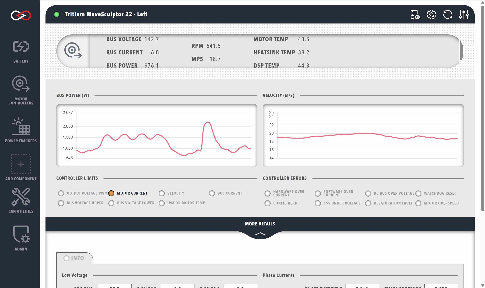

[Tritium](https://www.tritiumcharging.com/) initially created the WaveSculptor Motor Inverter, used by racing teams around the world.  With 99.2% cruising efficiency the WaveSculptor family is a go to choice for most high efficiency electric vehicle racing teams.  In 2021 [Prohelion](https://www.prohelion.com) took over the design, manufacturing and support for this product.

Profinity provides integrated management of the WaveSculptor products through the WaveSculptor dashboard, which can be accessed by adding a WaveSculptor to your [Profile](../../Getting_Started/Profiles.md) and selecting the appropriate tab from the sidebar. When adding a WaveSculptor to your Profile, you will be prompted to fill in the following information about your device. Note that these details can be changed later from `Change Settings` button at the top-right of the WaveSculptor dashboard.

| Parameter            | Description                                                                                  |
|----------------------|----------------------------------------------------------------------------------------------|
| `Name`               | The name of the component. Must be unique.                                                   |
| `Milliseconds Valid` | The timeout time of the device. If the network has not received any traffic from this device after this many milliseconds, it is assumed that the connection has been lost. |
| `Base Address`       | The CAN address of the BMU (See [WaveSculptor documentation](../../../Motor_Controllers/index.md)) |

<figure markdown>

<figcaption>Prohelion WaveSculptor</figcaption>
</figure>

<!-- Check this -->
Prohelion is currently migrating all of the Tritium WaveSculptor supporting software in to Profinity, in this release the configuration of the WaveSculptor tools is still handed by the Tritium software and we expect to migrate all of that functionality to Profinity over time.

## WaveSculptor Data

The top row of WaveSculptor dashboard presents a summary of the following information (left to right):

| Cell            | Meaning                                                                                      |
|-----------------|----------------------------------------------------------------------------------------------|
| `BUS VOLTAGE`   | Total voltage across the WaveSculptor DC input terminals, in volts.                          |
| `BUS CURRENT`   | Current being supplied to/from the WaveSculptor from/to the DC bus, in amps. Negative current indicates current out of the WaveSculptor (e.g., during regenerative braking). |
| `BUS POWER`     | The total power flow in/out of the WaveSculptor DC input terminals. Negative power indicates power flowing out of the WaveSculptor (e.g., during regenerative braking). |
| `RPM`           | The estimated speed of the motor, in revolutions per minute.                                 |
| `MPS`           | The estimated speed of the motor, in metres per second.                                      |
| `MOTOR TEMP`    | The temperature reading from the motor's onboard temperature sensor, in °C.                  |
| `HEATSINK TEMP` | The temperature reading from the WaveSculptor's heatsink temperature probe, in °C.                                     |
| `DSP TEMP`      | The temperature reading from the WaveSculptor's signal processing board temperature probe, in °C.                   |

Below the summary ribbon are some time-series graphs of the DC bus power and motor velocity to help display any general trends. There are also several status indicators which highlight when various controller limits have been reached or controller errors are present. More information about these limits and errors can be found in the [WaveSculptor documentation](../../../Motor_Controllers/index.md).

Clicking the `MORE DETAILS` banner will reveal another section revealing information about the internal controller state and control algorithm. The majority of this information is not necessary for general use, but it may be useful for more advanced use-cases or debugging. The data listed includes:

- Low voltage rails (1.9V, 3.3V, and 15V)
- Motor B and C phase currents
- D-Q reference frame motor vectors
    - Back-EMF
    - Stator voltage
    - Stator current
- Comms error counts

## Updating the WaveSculptor Configuration

!!! warning "Desktop instance required"
    Currently only the desktop release of Profinity includes the WaveSculptor configuration tools. Therefore, to update the configuration of your WaveSculptor, the WaveSculptor will need to be connected to desktop instance of Profinity for the duration of the update process. The WaveSculptor configuration tools are planned to become available in the Docker release in a future update.

To update the configuration of your WaveSculptor, select the `Setup and Configuration`. This will load the WaveSculptor setup and configuration utilities. More specific details about the WaveSculptor configuration can be found in the [WaveSculptor documentation](../../../Motor_Controllers/Config_Software/index.md).

!!! info "Tritium / Prohelion Adapter"
    The WaveSculptor configuration tools were developed by Tritium and rely on a CAN to Ethernet Bridge being present in the configuration.  If you do not have such a bridge, you can create a virtual one using the [Virtual CAN Adapter](../Adaptors/Virtual_CAN_Adapter.md) in conjunction with another bridge.

<!-- Video needs to be update, requires a physical WaveSculptor -->
<video autoplay loop controls width="100%">
  <source src="../../video/ConfigWS22.mov" type="video/mp4">
  Your browser does not support the video tag.
</video>

## Flashing the WaveSculptor Firmware

Once you have updated the configuration of your WaveSculptor, you will need to flash the WaveSculptor firmware. To do this, click on the `Update Firmware` button in the top-right of the WaveSculptor dashboard. As per the configuration tool, a CAN to Ethernet bridge or a [Virtual CAN Adapter](../Adaptors/Virtual_CAN_Adapter.md) is required for this operation.