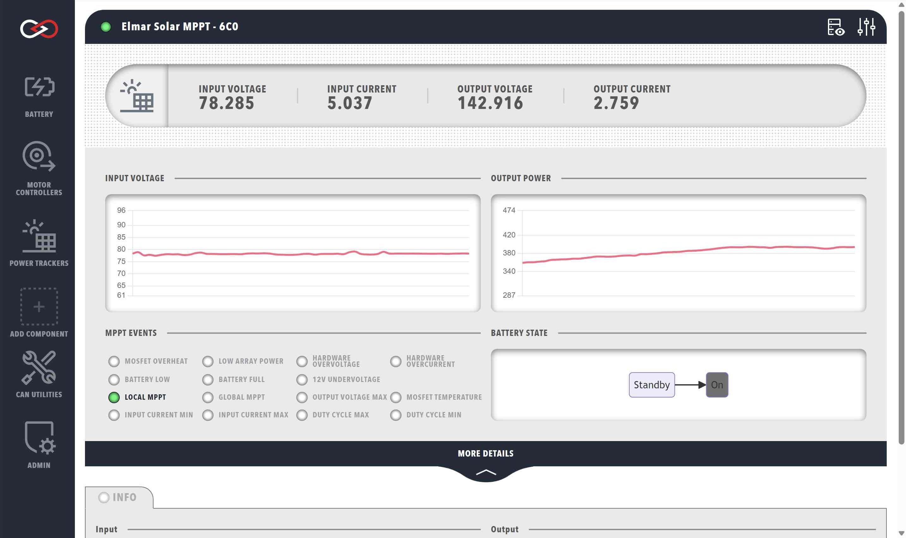

# Elmar Solar MPPT

Elmar Solar produces some of the worlds most efficient Peak Power Trackers (MPPT).  These trackers are used to optimize the power output of Solar Arrays. You can purchase Elmar Solar MPPT devices through the [Prohelion](https://www.prohelion.com) website.

You can manage an Elmar Solar MPPT using Profinity by adding a new Elmar Solar MPPT tracker to your [Profile](Profiles.md). When adding an Elmar Solar MPPT to your Profile, you will be prompted to fill in the following information about your device. Note that these details can be changed later from the MPPT dashboard.

<!-- Finish this -->
| Parameter            | Description                                                                           |
|----------------------|---------------------------------------------------------------------------------------|
| `Name`               | The name of the component. Must be unique.                                            |
| `Milliseconds Valid` |        |
| `Base Address`       | The CAN address of the MPPT (See [Elmar Solar MPPT documentation](../MPPTs/index.md)) |

Once the MPPT has been added to your profile, the Elmar Solar MPPT dashboard will be available in the sidebar. The dashboard displays several useful types of information, including the input/output voltage graphs, error status indicators, temperature readings, etc.

<figure markdown>

<figcaption>Elmar Solar MPPT</figcaption>
</figure>

The Elmar Solar MPPT devices also give you the ability to see the raw CAN data via the [DBC view](CAN_Bus_DBC.md). To access this, click on the `Messages and Signals` button in the top right corner of the dashboard.

## MPPT Data

The top row of the MPPT dashboard presents a summary of the following information (left to right):

| Cell              | Meaning                                                      |
|-------------------|--------------------------------------------------------------|
| `INPUT VOLTAGE`   | The voltage produced by the connected solar array, in volts. |
| `INPUT CURRENT`   | The current delivered by the connected solar array, in amps. |
| `OUTPUT VOLTAGE`  | The output voltage of the MPPT, in volts.                    |
| `OUTPUT CURRENT`  | The output current of the MPPT, in amps.                     |

Below the summary are two time-series graphs depicting the input voltage and output power of the MPPT. Hovering your cursor over the graphs showcases the data in greater resolution.

The lower left side of the window features numerous status indicators for MPPT events. These events include (but are not limited to):

- Reaching array limits (low power, over/under current)
- 12V undervoltage
- Reaching MPPT limits (max output voltage, min/max duty cycle)
- MOSFET temperature limits
- Battery-related flags (low or full)

For more information about the MPPT events, see the [Elmar Solar MPPT documentation](../MPPTs/index.md).

The right-hand side depicts a simplified flowchart of the connected battery's state, indicating whether or not current is able to flow from the MPPT to the battery. The current battery state is indicated by the gray box. For more information regarding the different battery states and the internal state machine, see the [BMU section](Prohelion_Batteries.md).