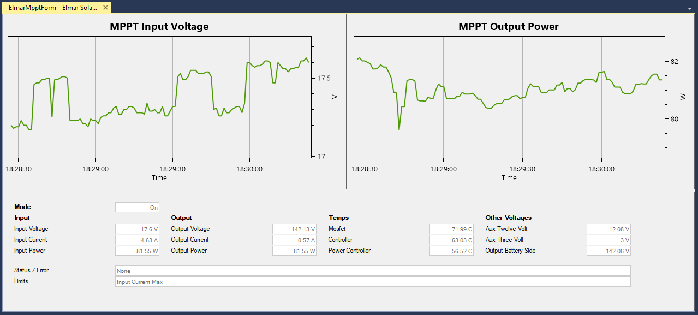

# Elmar Solar MPPT

Elmar Solar produces some of the worlds most efficient Peak Power Trackers (MPPT).  These trackers are used to optimize the power output of Solar Arrays. You can purchase Elmar Solar MPPT devices through the [Prohelion](https://www.prohelion.com) website.

You can manage an Elmar Solar MPPT using Profinity by adding a new Elmar Solar MPPT tracker to your [Profile](Profiles.md). An Elmar Solar MPPT is simple to set up in Profinity, requiring only the following parameters:

| Parameter            | Description                                      |
|----------------------|--------------------------------------------------|
| `Name`               | The name of the component. Must be unique.       |
| `Milliseconds Valid` |        |
| `Address Range`      |        |
| `Base Address`       |  (See [Elmar Solar MPPT documentation](../MPPTs/index.md)) |

Once the MPPT has been added to your profile, the Elmar Solar MPPT dashboard will be available in the sidebar. The dashboard displays several useful types of information, including the input/output voltage graphs, error status indicators, temperature readings, etc.

<figure markdown>

<figcaption>Elmar Solar MPPT</figcaption>
</figure>

The Elmar Solar MPPT devices also give you the ability to see the raw CAN data via the [DBC view](CAN_Bus_DBC.md). To access this you need to right mouse click on the item and select 'Show Messages and Signals'.