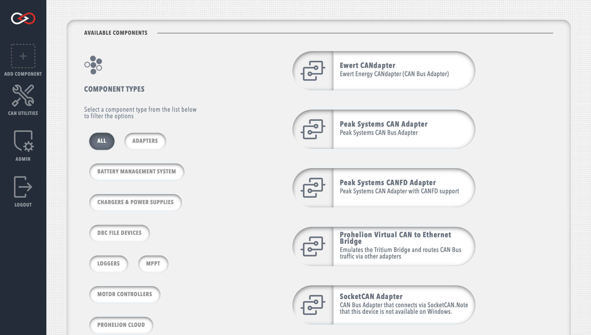

# Getting Started

<figure markdown>

<figcaption>Profinity V2 homepage</figcaption>
</figure>

By default only four tabs are available in the sidebar

Before adding any devices it is recommended to explore the System Configuration menu

## Creating a user

<figure markdown>

<figcaption>New user menu</figcaption>
</figure>

Each user can be granted different administrative privileges. Giving a user admin privileges automatically enables all other privileges.

## Creating a Profinity Profile Pack

Profinity Profile Packs behave similarly to Profiles from Profinity Classic.

## Adding a component

<figure markdown>

<figcaption>New component menu</figcaption>
</figure>

## Component types
