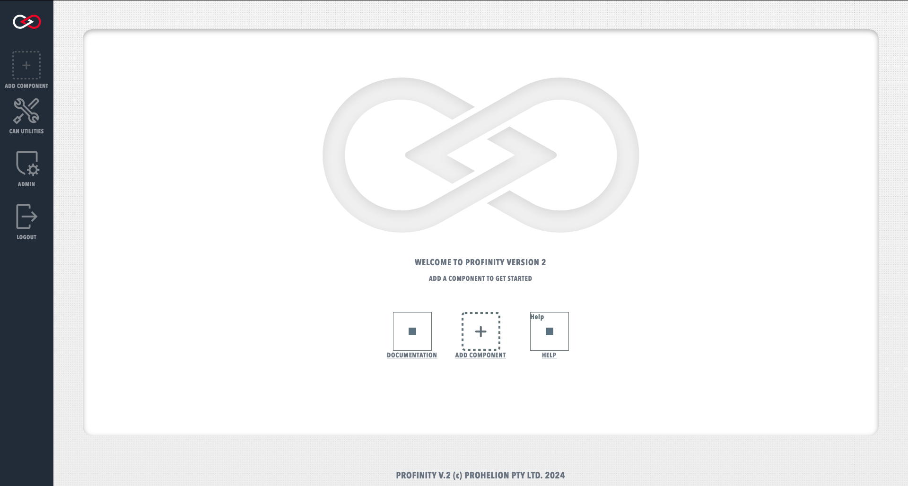
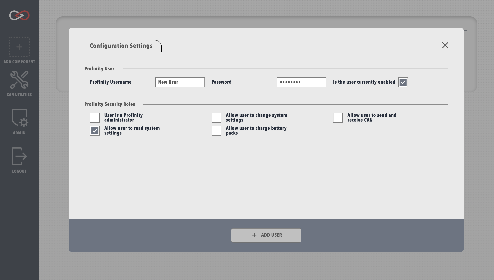
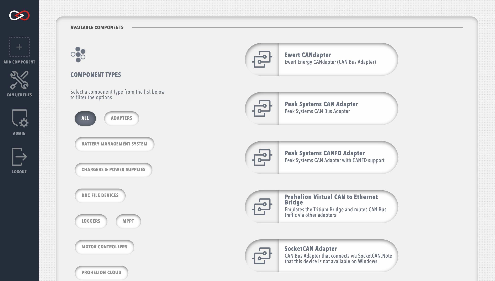
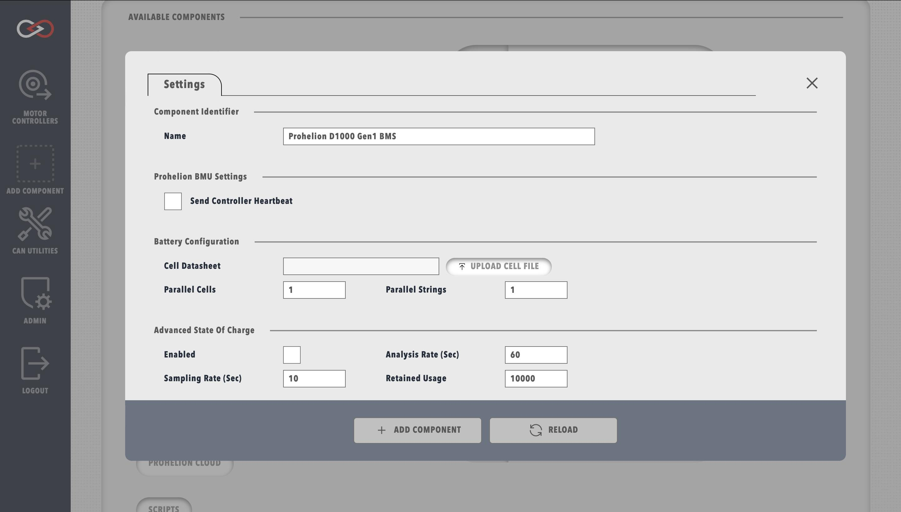
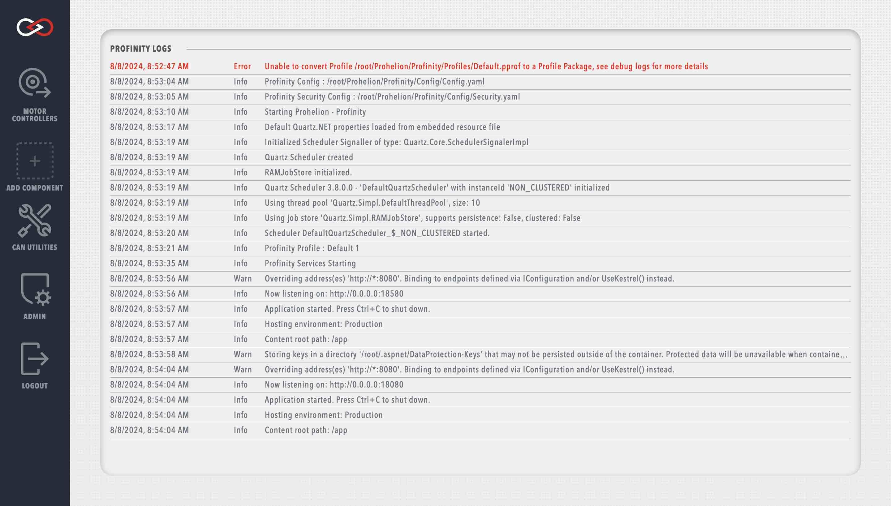

# Getting Started

<figure markdown>

<figcaption>Profinity V2 homepage</figcaption>
</figure>

By default only four tabs are available in the sidebar

Before adding any devices it is recommended to explore the System Configuration menu

## Creating a user

<figure markdown>

<figcaption>New user menu</figcaption>
</figure>

Each user can be granted different administrative privileges. Giving a user admin privileges automatically enables all other privileges.

## Creating a Profinity Profile Pack

Profinity Profile Packs behave similarly to Profiles from Profinity Classic.

More information can be found in the [Profinity Profile Packs](Profiles.md) section.

## Adding new items to your Profile

Items can be added to your profile by selecting the Add Component tab from the sidebar. A page with all of the currently supported items is presented, including hardware devices, data loggers, custom scripts, etc., allowing you to select the item that you wish to add. The page also includes filter options to help locate the correct item.

<figure markdown>

<figcaption>Add a new item to the Profile</figcaption>
</figure>

Upon selecting an item, you will be prompted to fill in the necessary details to finish setting up your item. The information required will vary greatly by item and can be modified later by editing the item properties. More information about specific item properties can be found in the dedicated item sections.

<figure markdown>

<figcaption>Example of defining item properties with Prohelion D1000 Gen1 BMS</figcaption>
</figure>

!!! info "Duplicate item names"
    You can add multiple items of the same type to your profile, but they must have unique names and the base address of the item is also generally unique. If the profile already has an item with the same name as what you are proposing, then a digit will be added to the item name to keep the profile item names unique.

Once you have added the component to your profile, an icon will appear in the sidebar to represent the new component. Hovering your mouse over a component icon in the sidebar will present a list of all devices associated with the current profile that match that component type. Each device will also have an coloured indicator to display the operational status of the device. The possible device statuses are summarised below.   

| Colour   | Meaning                                                                       |
|----------|-------------------------------------------------------------------------------|
| `Green`  | The device is available, sending valid data and is a valid state              |
| `Yellow` | The device is available, but is either not sending data or is a warning state |
| `Red`    | The device is in an error state                                               |
| `Grey`   | The device is not available, connected or not visible on the network          |

## Accessing System Logs

Profinity has a built in logging mechanism that captures information about the operation of the system and is designed to assist in system issue diagnosis. To access the system logs, navigate to the Admin tab, then select Logs.
<!--Typically this log appears at the bottom of the Profinity screen.  If you close the log and wish to view it again, then the log button on the menu bar will make it reappear.-->

<figure markdown>

<figcaption>Profinity System Logs</figcaption>
</figure>

Each log entry contains a timestamp, a message level (e.g., `Info`, `Warn`, `Error`, etc.), and a message description. To help diagnose particular issues, the scope of the system logs can be changed to only include particular message levels. More information about varying the displayed log levels can be found in the [System Administration](System_Admin.md) section.