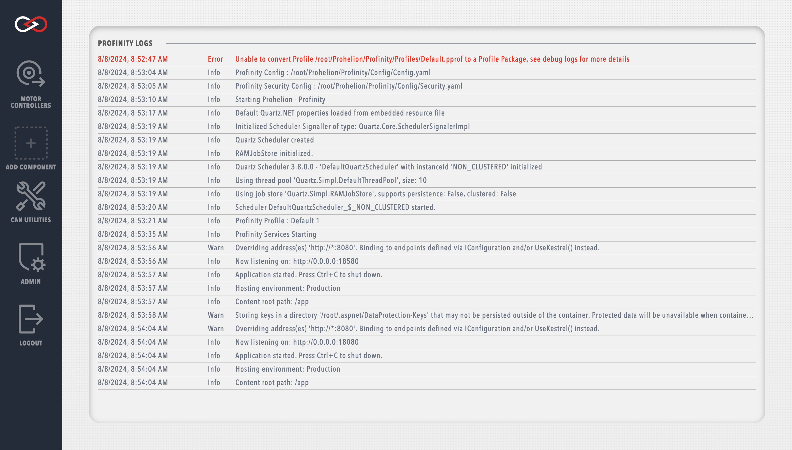

# Getting Started

<figure markdown>

<figcaption>Profinity V2 homepage</figcaption>
</figure>

By default only four tabs are available in the sidebar

Before adding any devices it is recommended to explore the System Configuration menu

## Creating a user

<figure markdown>

<figcaption>New user menu</figcaption>
</figure>

Each user can be granted different administrative privileges. Giving a user admin privileges automatically enables all other privileges.

## Creating a Profinity Profile Pack

Profinity Profile Packs behave similarly to Profiles from Profinity Classic.

More information can be found in the [Profinity Profile Packs](Profiles.md) section.

## Adding a component

<figure markdown>

<figcaption>New component menu</figcaption>
</figure>

## Component types

## Accessing System Logs

Profinity has a built in logging mechanism that captures information about the operation of the system and is designed to assist in system issue diagnosis. To access the system logs, navigate to the Admin tab, then select Logs.
<!--Typically this log appears at the bottom of the Profinity screen.  If you close the log and wish to view it again, then the log button on the menu bar will make it reappear.-->

<figure markdown>

<figcaption>Profinity System Logs</figcaption>
</figure>

Each log entry contains a timestamp, a message level (e.g., `Info`, `Warn`, `Error`, etc.), and a message description. To help diagnose particular issues, the scope of the system logs can be changed to only include particular message levels. More information about varying the displayed log levels can be found in the [System Administration](System_Admin.md) section.