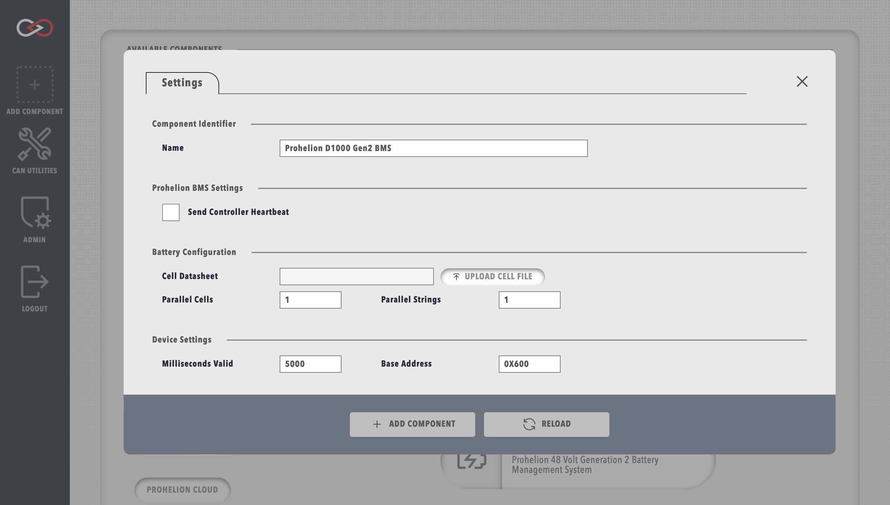

# Adding new Components to your Profile

Components can be added to your profile by selecting the `ADD COMPONENT` tab from the sidebar. A page with all of the currently supported components is presented, including hardware devices, data loggers, custom scripts, etc., allowing you to select the component that you wish to add. The page also includes filter options to help locate the correct component.

<figure markdown>

<figcaption>Add a new component to the Profile</figcaption>
</figure>

Each component in the Profile has a set of properties that define the configuration of the component. Upon selecting a component, you will be prompted to fill in the necessary configuration properties for the component. The information required will vary greatly by component and can be modified later by opening the `Change Setting` menu from the component's dashboard. More information about specific component properties and how to correctly configure each component can be found in the dedicated component sections.

<figure markdown>

<figcaption>Example of defining component properties</figcaption>
</figure>

!!! info "Duplicate component names"
    You can add multiple components of the same type to your profile, but they must have unique names and the base address of the component is also generally unique. If the profile already has an component with the same name as what you are proposing, then a digit will be added to the component name to keep the profile component names unique.

Once you have added the component to your profile, an icon will appear in the sidebar to represent the new component. Hovering your mouse over a component icon in the sidebar will present a list of all devices associated with the current profile that match that component type. Each component will also have an coloured indicator to display the operational status of the device. The possible device statuses are summarised below.   

| Colour   | Meaning                                                                       |
|----------|-------------------------------------------------------------------------------|
| `Green`  | The device is available, sending valid data and is a valid state              |
| `Yellow` | The device is available, but is either not sending data or is a warning state |
| `Red`    | The device is in an error state                                               |
| `Grey`   | The device is not available, connected or not visible on the network          |