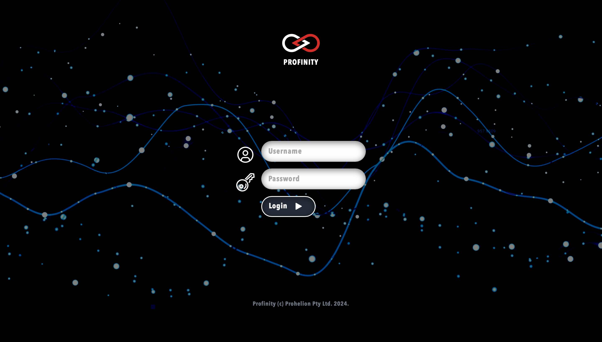
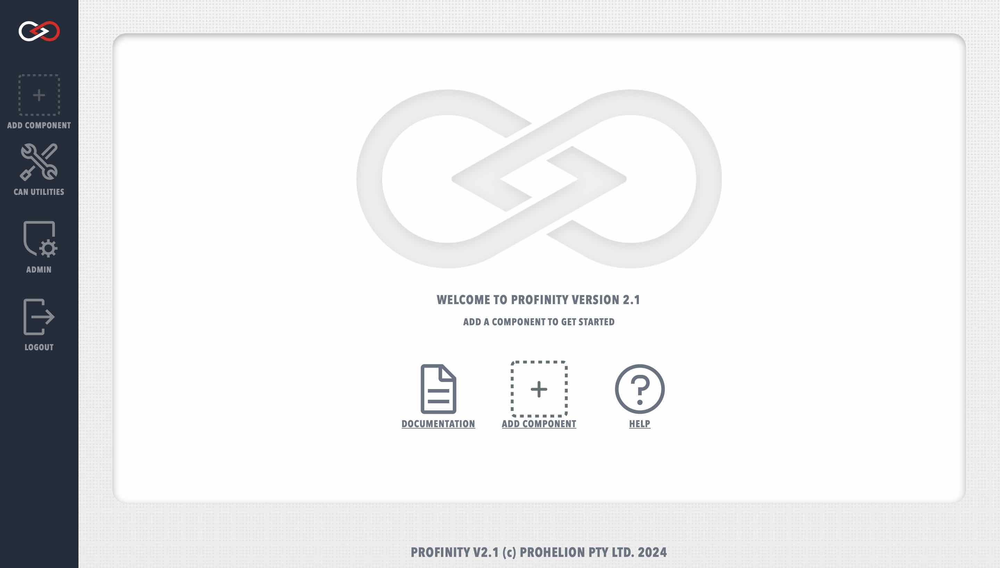

# Getting Started

Launching the Profinity V2 desktop client will take you directly to the Profinity V2 homepage. 

To launch the Docker client, follow the steps outlined in the [Docker installation guide](Installation.md#starting-and-stopping-profinity). Connecting to the Profinity web client will direct you to the Profinity V2 login page. 

<figure markdown>

<figcaption>Profinity V2 login page</figcaption>
</figure>

A fresh install of Profinity will only have the administrator user active. To log in, use the following login details.

Username: `admin`

Password: `password`

After logging in, you will arrive at the Profinity V2 homepage.

<figure markdown>

<figcaption>Profinity V2 homepage</figcaption>
</figure>

The Profinity V2 window is split into two sections; the main window and the sidebar. By default, the sidebar contains four tabs named `ADD COMPONENT`, `CAN UTILITIES`, `ADMIN`, and `LOGOUT`. More options will become available as you construct your system inside Profinity.

<!-- More here -->

## Creating a user

Once logged in, it is recommended to create a new user to suit your use case. To create a new user, select the `ADMIN` tab, `Users`, then `+ ADD USER`. Here you are able to define a new user and their associated login details.

<figure markdown>

<figcaption>New user menu</figcaption>
</figure>

Each user can also be granted different security roles, either allowing or restricting the different Profinity functionality that the particular user has access to. Giving a user the administrator role automatically grants the privileges of all other roles.

For example, it may be beneficial to create an 'Observer' user without edit access to allow viewing of system information without risk of accidentally changing any parameters.

## Creating a Profinity Profile Pack

Profinity Profile Packs behave similarly to Profiles from Profinity Classic. All of the components, scripts, CAN bus data, etc. that you configure for your system are assigned to the active Profile. By defining multiple Profiles, you are able to quickly and easily change between system configurations.

To change Profile or create a new Profile, navigate to the `ADMIN` tab, then select `Profile`. The active Profile can be selected by clicking on the appropriate radio button, or a new Profile can be created using the `+ ADD PROFILE` button.

<figure markdown>

<figcaption>Profinity Profile menu</figcaption>
</figure>

More information can be found in the [Profinity Profile Packs](Profiles.md) section.

## Adding new Components to your Profile

Components can be added to your profile by selecting the `ADD COMPONENT` tab from the sidebar. A page with all of the currently supported components is presented, including hardware devices, data loggers, custom scripts, etc., allowing you to select the component that you wish to add. The page also includes filter options to help locate the correct component.

<figure markdown>

<figcaption>Add a new component to the Profile</figcaption>
</figure>

Upon selecting an component, you will be prompted to fill in the necessary details to finish setting up your component. The information required will vary greatly by component and can be modified later by editing the component properties. More information about specific component properties and how to correctly configure each component can be found in the dedicated component sections.

<figure markdown>

<figcaption>Example of defining component properties</figcaption>
</figure>

!!! info "Duplicate component names"
    You can add multiple components of the same type to your profile, but they must have unique names and the base address of the component is also generally unique. If the profile already has an component with the same name as what you are proposing, then a digit will be added to the component name to keep the profile component names unique.

Once you have added the component to your profile, an icon will appear in the sidebar to represent the new component. Hovering your mouse over a component icon in the sidebar will present a list of all devices associated with the current profile that match that component type. Each component will also have an coloured indicator to display the operational status of the device. The possible device statuses are summarised below.   

| Colour   | Meaning                                                                       |
|----------|-------------------------------------------------------------------------------|
| `Green`  | The device is available, sending valid data and is a valid state              |
| `Yellow` | The device is available, but is either not sending data or is a warning state |
| `Red`    | The device is in an error state                                               |
| `Grey`   | The device is not available, connected or not visible on the network          |

## Reading Data

Once all of your components have been configured, you are ready to start receiving and reading data.

Each component in your system will have an associated dashboard which can be accessed by selecting the component from the sidebar. The component dashboards are tailored to the specific component and display all of the relevant information and data for that component in a convenient fashion.

<!-- More here, powering on system, different dashboards, etc. -->

## Accessing System Logs

Profinity has a built in logging mechanism that captures information about the operation of the system and is designed to assist in system issue diagnosis. To access the system logs, navigate to the `ADMIN` tab, then select `Logs`.

<figure markdown>

<figcaption>Profinity System Logs</figcaption>
</figure>

Each log entry contains a timestamp, a message level (e.g., `Info`, `Warn`, `Error`, etc.), and a message description. To help diagnose particular issues, the scope of the system logs can be changed to only include particular message levels. More information about varying the displayed log levels can be found in the [System Administration](../System_Admin.md) section.