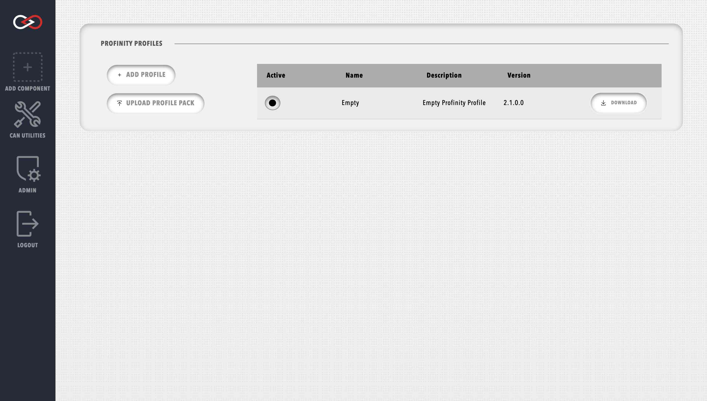

# Profinity Profile Packs

Profinity Profile Packs are a new introduction to Profinity V2 and serve as an extension to the Profile-based structure of Profinity Classic. A Profile Pack packages everything related to your instance of Profinity, allowing you to easily configure multiple machines to run the same system.

Depending on the configuration of your system, a Profile Pack could contain:

- [Profile](#profiles) and configured devices
- [DBC](CAN_Utilities.md#can-bus-dbc) files
- [Scripts]()
- [Battery cell profiles]()

## Profiles

A Profile is the core mechanism by which Profinity maintains the configuration of your system. Profiles typically consist of one or more CAN-Ethernet Bridges, which are used to connect to the CAN network as well as any devices that you might be managing.

Profinity keeps track of your profiles and loads the most recently used one each time you start the tool.

The Profile menu is located in the `ADMIN` tab.

<figure markdown>

<figcaption>Profinity Profiles menu</figcaption>
</figure>

Profinity ships with an example profile called the PET Profile (Prohelion / Elmar / Tritium) which contains all the necessary configuration to support a vehicle based on Prohelion, Elmar, and Tritium technologies.  If you wish to use this profile as a basis for your own work we would suggest copying it to a new file name as the file is overwritten each time you install a new version of Profinity. 

Otherwise you can create your own Profiles or a new Profile, by pushing the New Profile button on the menu.

!!! info "Renaming the active Profile"
    You cannot rename the active Profile in Profinity. In order to rename the active Profile, you must change to a different Profile, rename the desired Profile, and then change back. It may help to create a temporary Profile for this purpose, which can be deleted after you have rename your desired Profile.

## Profile Files

In Profinity the profiles themselves are stored by default as files in the directory

`/Documents/Prohelion/Profinity/Profiles`

While it is possible to edit the profile file directly in a text editor we do not recommend you do so. 

Storing the file in this way makes it easy to share a Profile and if it makes sense if your environment, profiles can be stored on network drives or other shares such as Google Drive or Dropbox, you can also share a read only version of your Profile via [Prohelion Cloud Connect](Prohelion_Cloud_Connect.md)

## Component Properties

Each item in the profile has a set of properties that define the configuration of the item.  These properties can be accessed by selecting the item or right mouse clicking on the item and selecting properties.  The properties then appear at the bottom of the profile panel, changing a property will set it in the profile.

Properties can also be set when the item is first created in the [New Items](Adding_New_Items.md) window.  

However, not all devices are configured directly via Properties, some devices that have more complex configuration setups like the [Prohelion Loggers](CAN_Utilities.md#log--replay-can-bus-messages) are configured via wizards that set the underlying properties correctly for you.  

<figure markdown>

<figcaption>Profile Properties</figcaption>
</figure>

The properties shown will depend on the device. Some devices have a range of values that are allowed for a property and if an invalid property is entered then an error will be shown. Information on the property is shown at the very bottom of the property panel.