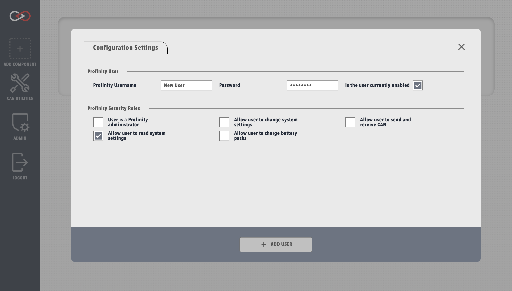

# Creating a User

## Overview

Before using Profinity, it's recommended to create a new user account tailored to your specific needs. This guide will walk you through the process of creating a user and assigning appropriate security roles.

## Creating a New User

1. Navigate to the user management section:
    - Click the `ADMIN` tab
    - Select `Users`
    - Click `+ ADD USER`
2. Fill in the user details in the form that appears

<figure markdown>

<figcaption>New User Creation Form</figcaption>
</figure>

## Security Roles

!!! info "Administrator Privileges"
    Users with the administrator role automatically receive all other role privileges.

### Available Roles

Profinity supports different security roles to control access to system functionality:

- **Administrator**: Full system access
- **Editor**: Can modify system settings
- **Observer**: Read-only access to system information

### Role Selection Guidelines

Consider these factors when assigning roles:

- User's technical expertise
- Required access level
- System security requirements

!!! tip "Best Practice"
    Create dedicated 'Observer' accounts for monitoring purposes. These accounts can view system information without the risk of accidental configuration changes.

## Next Steps

After creating a user:

1. Share the login credentials securely with the intended user
2. Have them change their password on first login
3. Verify they can access the required functionality

!!! warning "Security Notice"
    Always follow your organization's security policies when creating and sharing user credentials.