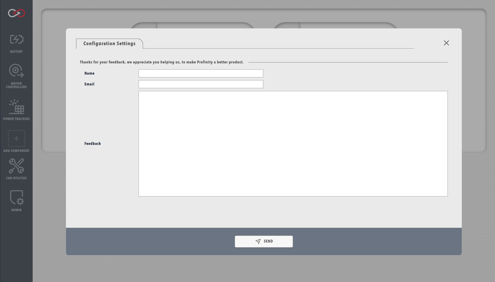

!!! tip "Profinity V2 IS NOW IN EARLY ADOPTER RELEASE"
    Profinity V2 is available now in Early Adopter Release.  To support this release we are making the product available to our Early Adopter Community.  If you have any issues or feedback please report it via our support portal or via the Feedback form in the Profinity Admin menu.

# Profinity Feedback

Profinity includes a built-in feedback system to help us improve our software and better support our users. This system allows you to share your suggestions, report issues, or provide general feedback about your experience with Profinity.

## Accessing the Feedback Form

The feedback form is accessible through the `ADMIN` tab in the Profinity interface. To access the form, open Profinity and navigate to the `ADMIN` tab in the navigation menu. From there, select the "Feedback" option to open the feedback interface.

<figure markdown>

<figcaption>Profinity feedback form interface</figcaption>
</figure>

## Providing Effective Feedback

To help us process your feedback effectively, we need some essential information. Your feedback should include your name and contact information, along with a clear description of your feedback or issue. If you're reporting a problem, please include any relevant error messages or screenshots that can help us understand the situation better.

When submitting feedback, please provide the following information:

- Your full name
- Your contact email address
- A detailed description of your feedback or issue

Additional information that can help us better understand your feedback includes:
- Steps to reproduce any issues you're experiencing
- Your operating system and Profinity version
- Any relevant error messages

## What Happens Next?

After you submit your feedback our team will review your submission and may contact you for additional information if needed. 

## Alternative Support Options

If you need immediate assistance or have urgent issues, we provide several support channels. You can visit our [Support Portal](https://prohelion.atlassian.net/servicedesk/customer/portals) for comprehensive support resources, [Contact Us](https://www.prohelion.com/contact-us/) directly through the Prohelion website, or check our [FAQs](../../../FAQs/index.md) for quick answers to common questions.