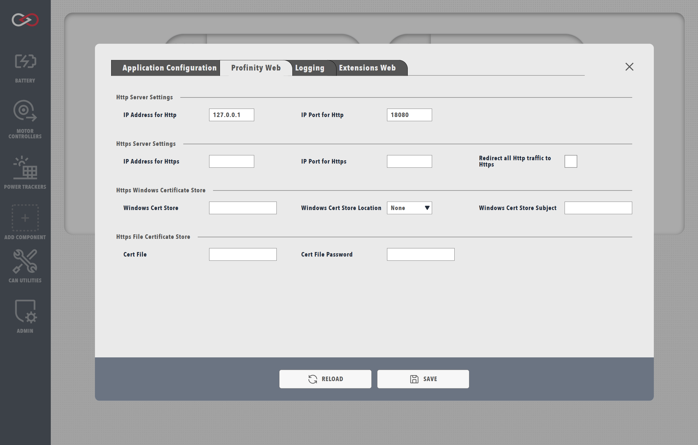
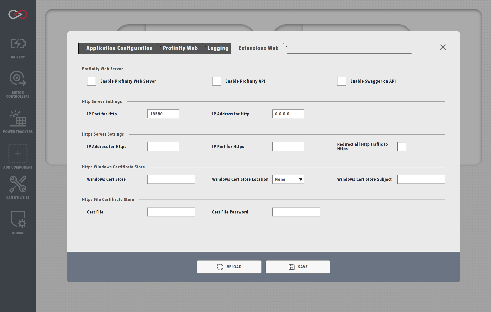

!!! tip "Profinity V2 IS NOW IN EARLY ADOPTER RELEASE"
    Profinity V2 is available now in Early Adopter Release.  To support this release we are making the documentation public.  To get access to the Profinity V2 installers, please log a support request at the [Prohelion Support Portal](https://prohelion.atlassian.net/servicedesk/customer/portals) requesting access to the Early Adopter release.

# System Configuration

The `System Configuration` menu is located in the `ADMIN` tab and contains all the configuration options for the core Profinity instance.

!!! warning "Changes to the system config"
    Modifying any parameters in the `System Configuration` menu will trigger a reboot of Profinity. If using the web client, wait around 15 seconds after saving the changes before reloading the page, on the desktop client the page should automatically reload after the engine reboots.

### Application Configuration

| Parameter                          | Description |
|------------------------------------|--|
|`Maximum number of retained Packets`| Profinity retains CAN Packets for use in the CAN Utilities, you can adjust the size of the number of retained packets if required. |
|`Custom Update Server`              | Profinity supports the use of Custom Update Servers for release management, if you are running the standard version of Profinity, this field should be left blank. |
|`Enable Scripting`                  | If you want your Profinity instance to support scripting, this field must be selected.  Scripting requires security considerations and as such is not activated by default. |

<figure markdown>

<figcaption>Profinity System Configuration</figcaption>
</figure>

### Profinity Web

The Profinity Web menu allows you to configure all the parameters that control how Profinity offers its web server connections to the users.  Profinity supports both Http and Https connections as well as custom Https certificates.

<figure markdown>

<figcaption>Profinity web menu</figcaption>
</figure>

| Parameter                          | Description |
|------------------------------------|--|
|`IP Address for Http`               | What IP address do you want Profinity to run on for HTTP, by default this is localhost (127.0.0.1) or all IP Addresses (0.0.0.0), however if required a specific IP Address can be set. |
|`IP Port for Http`                  | What port should be used for http (default is 18080), setting this below 1024 requires admin permissions |
|`IP Address for Https`              | Same as the Http address but for Https (127.0.0.1 or 0.0.0.0) |
|`IP Port for Https`                 | Same as the Http port but for Https |
|`Redirect all Http traffic to Https`| Force the system to use Https for all traffic |
|`Windows Cert Store`                | When using HTTPS on Windows, you can specify a certificate from the Windows Certificate Store. This is typically used when you have a certificate installed in your system's certificate store. |
|`Windows Cert Store Location`       | The location of the certificate store. Common values are: `CurrentUser` (for user-specific certificates) or `LocalMachine` (for system-wide certificates). |
|`Windows Cert Store Subject`        | The subject name of the certificate as it appears in the Windows Certificate Store. This should match exactly with the certificate's subject name. |
|`Cert File`                         | Alternative to using the Windows Certificate Store, you can specify a certificate file (typically .pfx or .p12 format) for HTTPS. |
|`Cert File Password`                | If using a certificate file, provide the password used to protect the certificate file. |

!!! tip "Finding Certificate Information on Windows"
    To find the correct certificate store location and subject name:
    1. Open Windows Certificate Manager (certmgr.msc)
    2. Navigate to the appropriate store (Personal, Trusted Root, etc.)
    3. Find your certificate and double-click it
    4. The subject name is listed in the "Subject" field
    5. The store location is shown in the certificate manager's navigation tree

### Extensions Web

Profinity's web server can be extended to run your custom applications and provides access to the same APIs that Profinity itself uses for all functionality.  This extension is handed through the Extension Web configuration options. 

By using the Extensions Web, Profinity can be configured to run custom Kiosk applications, support custom web applications for vehicles and many more applications.

<figure markdown>

<figcaption>Extensions web menu</figcaption>
</figure>

| Parameter                          | Description |
|------------------------------------|--|
|`Enable Profinity Web Server`       | Enable or disable the Profinity web server for extensions |
|`Enable Profinity API`              | Enable or disable the Profinity API in that instance of the Web Server for extensions |
|`Enable Swagger on API`             | Enable or disable [Swagger UI](https://swagger.io/tools/swagger-ui/) for API documentation |
|`IP Address for Http`               | What IP address do you want Profinity to run on for HTTP, by default this is localhost (127.0.0.1) or all IP Addresses (0.0.0.0), however if required a specific IP Address can be set. |
|`IP Port for Http`                  | What port should be used for http (default is 18080), setting this below 1024 requires admin permissions |
|`IP Address for Https`              | Same as the Http address but for Https (127.0.0.1 or 0.0.0.0) |
|`IP Port for Https`                 | Same as the Http port but for Https |
|`Redirect all Http traffic to Https`| Force the system to use Https for all traffic |
|`Windows Cert Store`                | When using HTTPS on Windows, you can specify a certificate from the Windows Certificate Store. This is typically used when you have a certificate installed in your system's certificate store. |
|`Windows Cert Store Location`       | The location of the certificate store. Common values are: `CurrentUser` (for user-specific certificates) or `LocalMachine` (for system-wide certificates). |
|`Windows Cert Store Subject`        | The subject name of the certificate as it appears in the Windows Certificate Store. This should match exactly with the certificate's subject name. |
|`Cert File`                         | Alternative to using the Windows Certificate Store, you can specify a certificate file (typically .pfx or .p12 format) for HTTPS. |
|`Cert File Password`                | If using a certificate file, provide the password used to protect the certificate file. |

