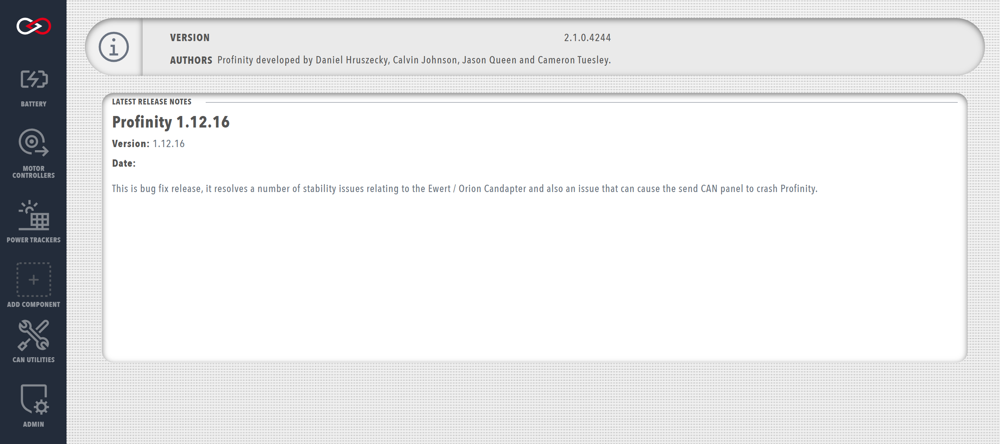

!!! tip "Profinity V2 IS NOW IN EARLY ADOPTER RELEASE"
    Profinity V2 is available now in Early Adopter Release.  To support this release we are making the product available to our Early Adopter Community.  If you have any issues or feedback please report it via our support portal or via the Feedback form in the Profinity Admin menu.

# System Information

To see which version of Profinity you are running, select the `System Information` option in the `ADMIN` tab.

<figure markdown>

<figcaption>System information page</figcaption>
</figure>

This page also contains notes about the latest Profinity releases and the software credits.