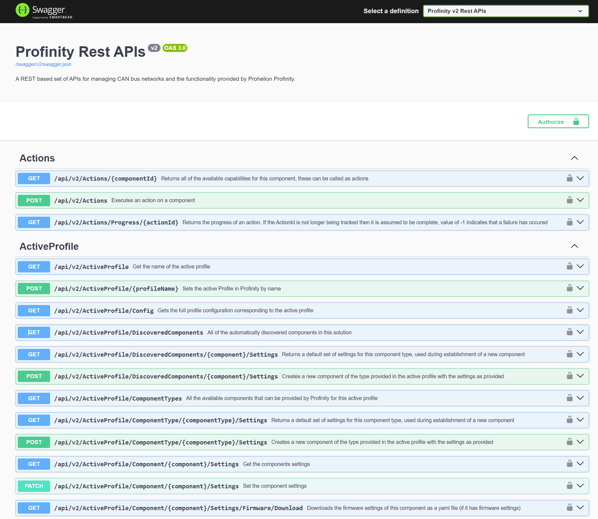

# Rest APIs, Swagger and Hosting

Prohelion is actively developing the Profinity Rest APIs as part of a transition of Profinity to a next generation management solution.  In doing this we taking a very widely used but tradition solution of CAN Bus and bringing it in to the modern world of Cloud, Docker, Rest and other technologies that are used to build modern, leading edge, user interfaces and applications.

As well as supporting Restful APIs, Profinity's overall solution allows you to build completely custom User Interfaces based on Profinity and host those interfaces either externally or within the Profinity solution.

!!! info "Important Information Regarding Profinity Rest APIs"
    Prohelions API solution is currently evolving rapidly as we develop new capabilities. Please be aware of this when developing solutions based on Profinity's APIs, as available APIs and models may evolve rapidly from release to release. 

!!! danger "Profinity APIs are unsecured on Public Network Interfaces"
    Our Profinity API's do not currently support API security and are designed to be used behind a user interface and in a secured environment.  If you are planning to expose these APIs via outside of the server or directly to clients we would suggest front ending them with a API gateway for enhanced security.

## Enabling Rest APIs


`/Documents/Prohelion/Profinity/Config/Config.yaml`

Or if you are running on MacOs or Linux under your home directory.

`$home/Prohelion/Profinity/Config/Config.yaml`

To access the APIs you will need to both enable the Profinity integrated web server and API's.  To do so, set the WebSite to be enabled as well as both the RestAPI's and for development purposes we would also suggest enabling [Swagger](https://swagger.io).

```
  WebServer:
    Urls: http://localhost:5000
    HttpsRedirect: false
    WebSite:
      Enabled: true
    RestAPI:
      Enabled: true
      Swagger: true
```

Restart Profinity and you should now be able to go to the Rest APIs Swagger Interface at http://localhost:5000/swagger, or whatever port and interface combination you have setup followed by /swagger and from there you will be able to see the specifications for the API's and test their capabilities.

Requests to retrieve CAN Packet information allow you to retrieve the packet either via CAN Id or using a DBC Message and Signal.

<br>

### Testing with Swagger

Prohelions API solution allows you to test your API calls in Swagger before developing any code.  

<figure markdown>

<figcaption>Using Swagger to try Profinity APIs</figcaption>
</figure>
<br>

### Accessing Historical Data via APIs

APIs can provide both realtime and historical data, when a InfluxDB database is configured in the profile.  If no InfluxDB is setup, then only realtime data is available.

The __/api/v1/CAN/{Message}/{Signal}__ api is used to get historical data.  To use this API request a DBC Message and Signal as well as a InfluxDB time range that you wish to retrieve the data for.  The API will then call InfluxDB and retrieve all of the data stored across that time frame for this signal.

For more information on configuring InfluxDB see the [InfluxDB and Prometheus Integration](../Components/Loggers/InfluxDB_Prometheus_Integration.md) section of this documentation.

## Hosting Custom Web User Interfaces

As well as hosting the Rest APIs and Swagger interface, Profinity supports an integrated Web Server that can provide hosting for a custom build application based on these APIs in any modern web technology.  This includes language and frameworks such as [ReactJS](https://react.dev/) and [Angular](https://angular.io) as well as traditional HTML / Javascript etc.

`/Documents/Prohelion/Profinity/Webroot`

Or if you are running on MacOs or Linux under your home directory.

`$home/Prohelion/Profinity/Webroot`

By default the Profinity web server will serve the index.html file from this directory if no URL is provided by the calling web browser.

## Production Configuration and HTTPs

The Profinity Web Server supports SSL / TLS style certificates for Production environments.  There are two options available for certificates, either using a Windows Certificate Store or providing a Certificate file and Password, which works on either Windows or MacOS & Linux.

HttpsRedirect can be set for force all HTTP traffic to the HTTPs interface and second HTTPs interface should be provided in the Urls option in this case. We would generally also recommend disabling Swagger in a production environment.

When using a certification from a Windows Certificate store you will need to provide the CertStoreName, CertStoreLocation and CertStoreSubject properties in the configuration file