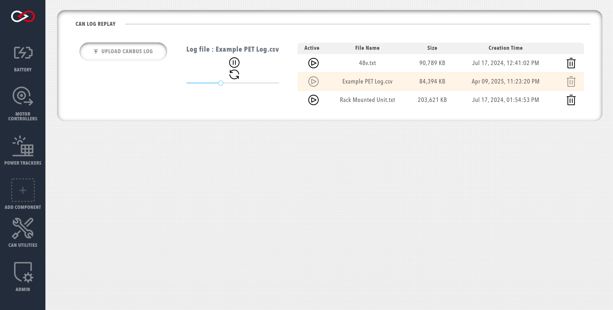

!!! tip "Profinity V2 IS NOW IN EARLY ADOPTER RELEASE"
    Profinity V2 is available now in Early Adopter Release.  To support this release we are making the documentation public.  To get access to the Profinity V2 installers, please log a support request at the [Prohelion Support Portal](https://prohelion.atlassian.net/servicedesk/customer/portals) requesting access to the Early Adopter release.

# Log / Replay CAN Bus Messages

Profinity provides the ability to both log and replay messages off your CAN Bus network as well as the ability to log CanBUS data to timeseries databases like InfluxDB and Prometheus.  

To log a set of CAN Bus messages first add an adapter to your [Profile](../Getting_Started/Profiles.md) and then connect to the adapter.  

It's always worth checking that you are actually receiving CAN Bus messages by using the [Receive CAN Bus](Send_Receive_CAN_Bus_Messages.md#receive-can-packets) window first.  Once you have got CAN Bus messages coming in to Profinity you are read to log.

## Logging CAN Bus

There are three distinct types of loggers available in Profinity, loggers to [log to file](../Components/Loggers/File_Loggers.md) and loggers that log to timeseries databases such as [InfluxDB and Prometheus](../Components/Loggers/InfluxDB_Prometheus_Logger.md) and finally [MQTT Loggers](../Components/Loggers/MQTT_Logger.md)

All loggers are configured in the same manner, by adding a logger as a component to the Profile.

!!! info "Replaying Logs Requires a File Logger"
    It is not possible to replay log files using the CAN Data Log Replayer below from Influx or Prometheus data, only a File log of the CAN Message from a File, FTP or SFTP logger can be used.

## CAN Data Log Replayer

The Profinity data log replayer allows you to replay log files that have previously been recorded in Profinity.

To use this tool simply select the log file and it will start replaying.  There are also a number of options available that can change the way the log file is replayed. Sliding the slider back and forth allows you to easily move to new locations in the CAN Bus replay file, Pausing causes the log file to pause replaying and you can restart the log file later if required.  Pressing the trashcan icon will delete the log.  Log files that you have recorded earlier or on other Profinity instances can be uploaded to this Profinity instance via the `UPLOAD CANBUS LOG` button.

<figure markdown>

<figcaption>Data Log Replayer</figcaption>
</figure>