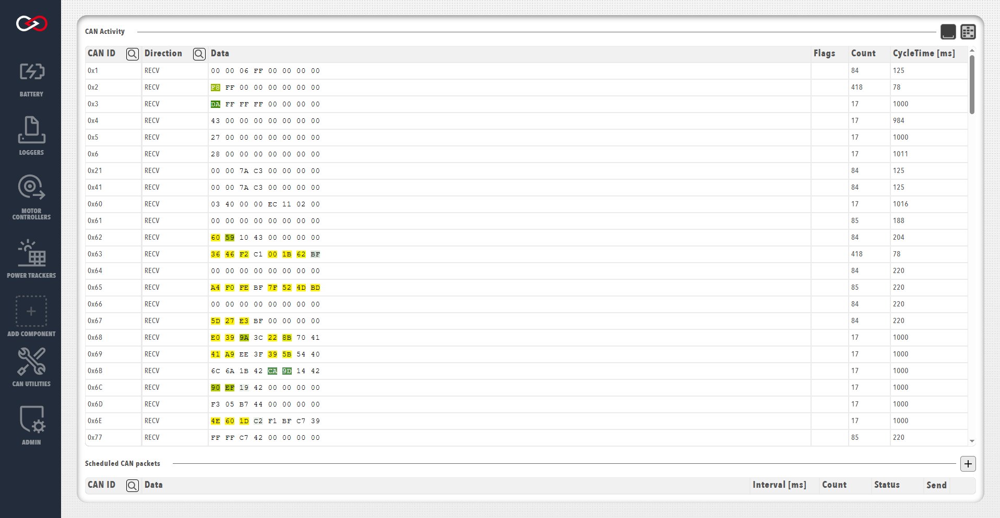

!!! tip "Profinity V2 IS NOW IN EARLY ADOPTER RELEASE"
    Profinity V2 is available now in Early Adopter Release.  To support this release we are making the documentation public.  To get access to the Profinity V2 installers, please log a support request at the [Prohelion Support Portal](https://prohelion.atlassian.net/servicedesk/customer/portals) requesting access to the Early Adopter release.

# Send / Receiving CAN Bus Messages

Profinity can monitor CAN Bus traffic on your network and also allows you to transmit message back on the CAN network from within the Profinity toolset.

Messages can be transmitted either via the `SEND & RECEIVE CAN` window which is documented below or also via the [CAN Replay](Logging_Replaying_CAN_Bus_Messages.md) tool.

!!! info "Check user privileges"
    Before trying to send or receive any CAN packets, ensure that the current user has the associated privilege enabled.

## Receive CAN Packets

Click on the `SEND & RECEIVE CAN` menu item to see a view of all the CAN Bus messages currently travelling across your network.

<figure markdown>

<figcaption>Receive CAN Packets</figcaption>
</figure>

Clicking on the `CAN Activity` table headers allow you to filter and/or sort the messages by CAN ID, direction, flags, etc. <!-- and change various other settings like the Endian representation of the message (Big Endian vs Little Endian) and exclude local traffic (traffic from Profinity) if the adapter supports that (not all adapters support local filtering). -->

There are two additional controls available at the top of the window, named `Spaced data` and `Heatmap`. Toggling on the `Spaced data` option will break the CAN traffic data into individual hex bytes to make it easier to read. With the `Heatmap` option toggled, bytes that change value frequently are highlighted with warmer colours and bytes that remain relatively constant are highlighted with 
cooler colours. 

Both these options are selected by default but can be switched off if required.

## Scheduled CAN Packets

At the bottom of the screen is your scheduled CAN Packets, you can add additional scheduled CAN Packets to send by clicking on the `+` icon.  Packets can be sent only once or can be saved and Profinity will add the packet to a list of scheduled Packets and continue to send the pack in the background.

!!! info "Note Logging Off Does Not Stop Packets Sending"
    If you setup a CAN Packet in Profinity to regularly send and then log off from Profinity, the packet will continue to send.  To stop a packet sending, delete it in the Scheduled CAN Packet list.

### Adding a Scheduled Packet

Click on the `+` symbol to schedule a new CAN Packet to be sent.

!!! info "Default is little endian"
    The default byte order used is little endian to align with Windows / Intel systems.  Little endian is used by most of the Prohelion technologies.

<figure markdown>

<figcaption>Send CAN Packet</figcaption>
</figure>

The Scheduled CAN Packet window allows you to transmit messages back on to the CAN Bus Network from Profinity. From this tool you can set the CAN ID, endian as well as the values for either Bytes, Int16, Int32, Floats or the raw packet data.

When you change one of these values the raw data updates to reflect that.  Likewise when you change the raw data the values update to reflect that change.

Setting and interval will cause Profinity send your CAN packet at your chosen loop rate, so setting the Interval (ms) to 100 sends the packet every 100ms.

### Sending a Packet on Demand

If your packet is not setup on a schedule then you can run it manually at any time by clicking on the send Arrow in the Scheduled CAN Packets window or selecting the line of the CAN Packet and pressing the space bar.