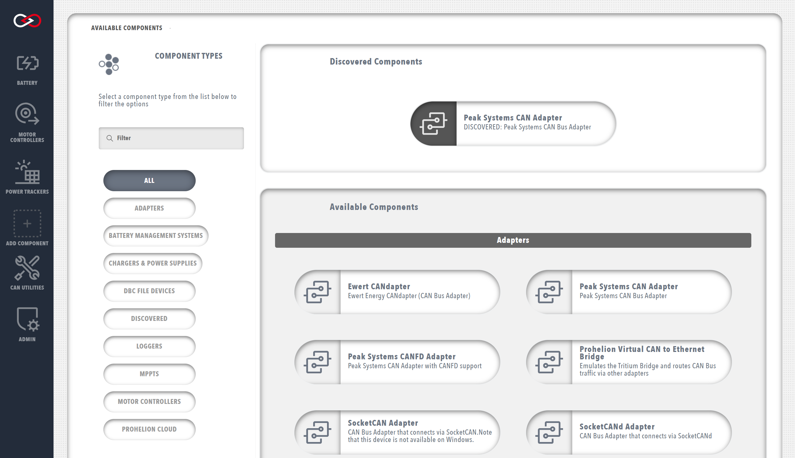

# CAN Bus Adapters

An adapter is the technology that you use to connect Profinity to your CAN bus network.  

Profinity on Windows supports the [Prohelion and Tritium CAN bus bridges](../../../../CAN_Bridge/index.md), SocketCAN using the [SocketCanD](https://github.com/linux-can/socketcand) technology, and the [Peak CAN to USB Adapter](https://www.peak-system.com/PCAN-USB.199.0.html?&L=1).

!!! info "When running the Peak CAN to USB Adapter"
    It is necessary to install the driver for the device before starting Profinity.  Use the supplied Peak tools to ensure your adapter is working as expected before starting Profinity and then AutoDiscovered the adapter as per normal

When running Profinity on [Docker](../../Installation/Docker_Installation.md) or on [macOS / Unix](../../Installation/Zip_Installation.md), additional support is also provided for the native [SocketCAN adapter](https://docs.kernel.org/networking/can.html).

Adapters can be added in one of two ways, either via Auto Discovery or Manually.

## Adapter Auto Discovery

In many cases the supported CAN bus adapters can be automatically found via the Auto Discovery mechanism. 

If an adapter is defined and visible on the network but is not currently associated with the current Profile, then a `Discovered` category will appear in the `ADD COMPONENT` window. In the `Discovered` category you will find all of the adapters that are currently visible to Profinity.  If your adapter does not show up here then you may have configuration issues that need to be addressed [manually](#adapter-manual-configuration), or may not currently be discoverable.

<!-- Needs to be updated -->
<figure markdown>

<figcaption>Add an Adapter via AutoDiscovery</figcaption>
</figure>

!!! info "Having trouble finding a CAN over Ethernet bridge with Autodiscovery?"
    The CAN over Ethernet bridges have a number of configuration options and at times may not behave as expected.  See our guide on the [CAN to Ethernet bridges](../../../../FAQs/CAN_bus_Adapters/CAN_Ethernet_Bridge/index.md) for troubleshooting advice.

## Adapter Manual Configuration

Configuring a CAN bus adapter manually follows a very similar process to other components. 

First, [add the adapter](../../Getting_Started/Adding_New_Components.md) to your Profile. When adding a CAN bus adapter to your Profile, you will be then be prompted to fill in the following information about your device. 

Note that these details can be changed later from `Change Settings` button at the top-right of the adapter dashboard.

|Parameter                | Description                                               |
|-------------------------|-----------------------------------------------------------|
|`Name`                   | The name of the component. Must be unique.                |
|`Auto Connect`           | Automatically enables the device when starting Profinity. |
|`Allow Loopback Traffic` | On the Tritium adapters there is an option to allow Loopback traffic, effectively allowing the system to echo traffic back to itself.  Other adapter do not support this option. |

## Adapter Status

Once your adapter has been added to the Profile, a coloured status indicator will be displayed in the sidebar next to the device name.  Ideally your adapter should have a green circle. The colour signals for the adapters are as follows;

| Colour   | Meaning                                               |
| -------- | ----------------------------------------------------- |
| `Green`  | Good, adapter is connected and we are getting data    |
| `Yellow` | Warning, adapter is connected but no data is arriving |
| `Red`    | Error, see the logs for more details                  | 
| `Grey`   | N/A, adapter is not connected                         |

!!! info "CAN bus bitrate"
    In order for all of the devices on your CAN bus to communicate, they must all be operating at the same bitrate, including the CAN bus adapter that connects Profinity to your CAN bus. Some devices allow you to configure the bitrate (can be done through the component configuration menus), but some devices only offer a specific bitrate that will put constraints on the other devices in the network. This should be a consideration when designing your system.