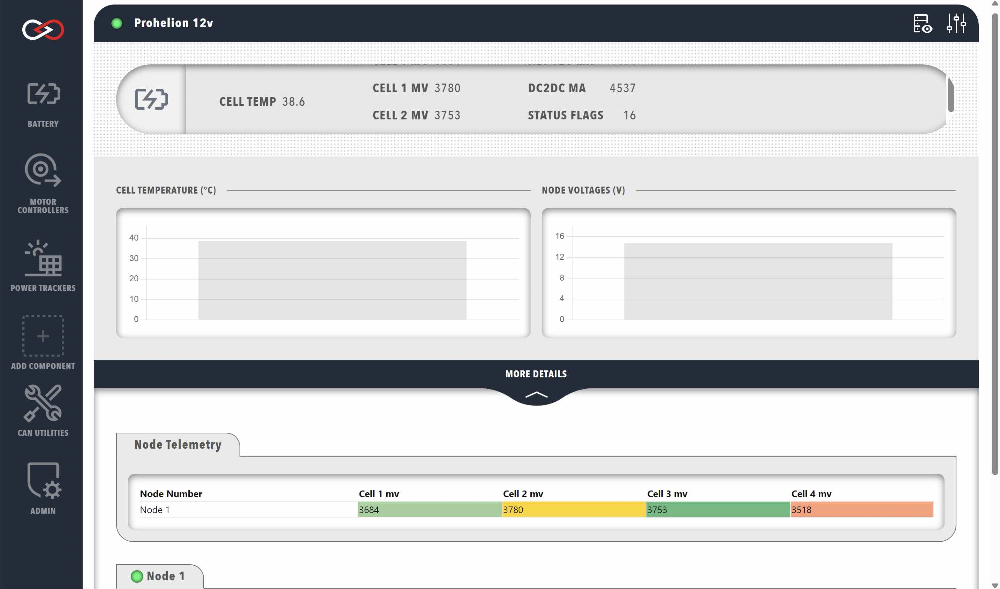

# Prohelion 12V Control System

Prohelion offers a 12V control module that can be used to provide power to onboard 12 volt systems and is typically used in a racing environment. This module is often used in conjunction with a [Prohelion BMU](Prohelion_Batteries.md) and interacts with Profinity in a very similar manner. Like the BMU, the 12V control module must be added to the Profile and provides additional data on the performance of the 12V system through a separate dashboard.

<!--## 12V Dashboard

The dashboard for the 12V system is largely identical to the BMU dashboard.

| Cell              | Meaning                                                                                                                |
|-------------------|------------------------------------------------------------------------------------------------------------------------|
| `BATTERY VOLTAGE` | Total voltage of the battery pack, in volts.                                                                           |
| `CURRENT`         | Current being supplied to/from the battery pack, in amps. Negative current indicates current flowing into the battery. |
| `SOC %`           | Estimation of the remaining charge in the battery, as a percentage of the user-set total pack capacity.                |
| `MAX CELL`        | Maximum cell voltage within the battery pack, in volts.                                                                |
| `MIN CELL`        | Minimum cell voltage within the battery pack, in volts.                                                                |
| `MAX CELL TEMP`   | Maximum cell temperature within the battery pack, in degrees Celsius.                                                  |
| `MIN CELL TEMP`   | Minimum cell temperature within the battery pack, in degrees Celsius.                                                  |
-->
<figure markdown>

<figcaption>Prohelion 12 Volt Dashboard</figcaption>
</figure>