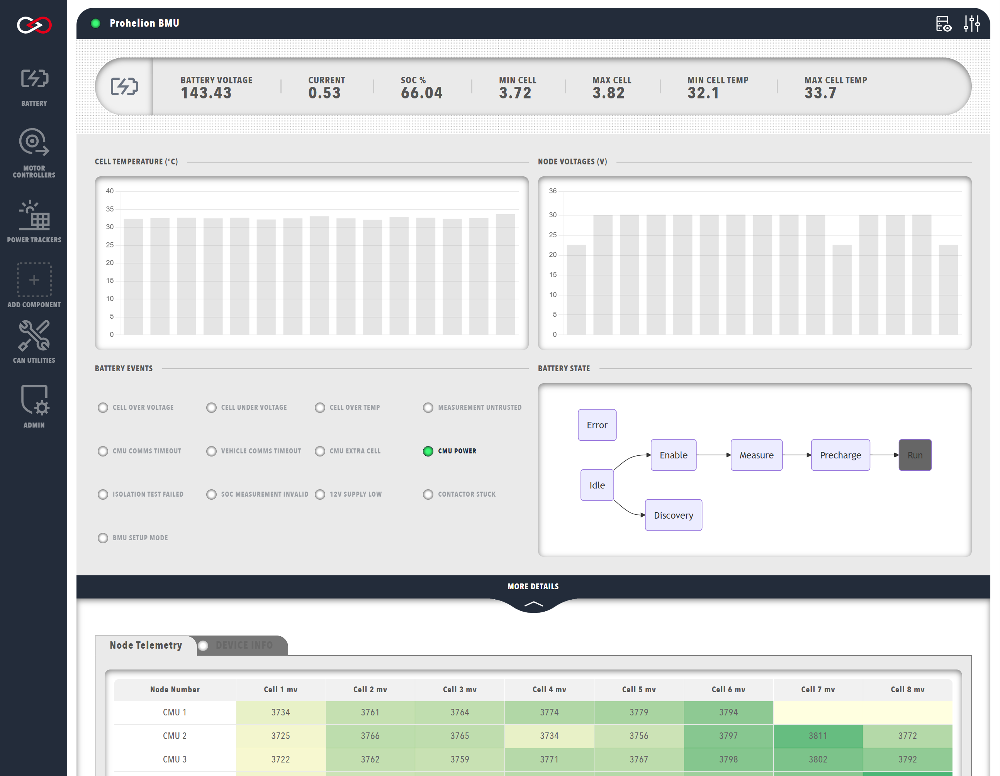

# Prohelion Battery Management Systems

Prohelion design and sells Battery Management Systems (BMS) designed for both automotive and fixed location environments.

The Prohelion Battery Management technology is built around three main components. All systems will include the Battery Management Unit (BMU) master board and a number of Cell Management Units (CMUs).  In addition to the BMU and CMUs a typical Prohelion battery may also contain a 12V Control System which monitors the onboard 12V capabilities.  For more information on these products, please see the main [Prohelion Website](https://www.prohelion.com/product-category/bms/).

Profinity supports the management and monitoring of the BMUs, CMUs, and 12V systems via your Profile.

!!! info "CMUs are managed by the BMU"
    Prohelion CMUs utilise a second CAN network organised by the BMU, and thus do not need to be added as components to your Profile. By adding the BMU to your Profile, you are able to control and see data from the entire BMS. For more information, see [Prohelion BMS documentation](../../../../Battery_Management_Systems/index.md).

A typical battery will generally only have one BMU, but larger packs or split packs like the ones used in racing can involve two or more BMUs.  If your pack is configured as such, then you simply add multiple BMUs to your Profile with different base CAN addresses.

## BMU Management

You can manage a Prohelion BMU using Profinity by adding a new Prohelion BMU to your [Profile](../../Getting_Started/Profiles.md). When adding a Prohelion BMU to your Profile, you will be prompted to fill in the following information about your device. Note that these details can be changed later from `Change Settings` button at the top-right of the BMU dashboard.

<!-- Finish this -->
|Parameter                  |Description                                                                                         |
|---------------------------|----------------------------------------------------------------------------------------------------|
|`Name`                     | The name of the component. Must be unique.                                                         |
|`Send Controller Heartbeat`| ??? |
|`Cell Datasheet`           | ??? |
|`Parallel Cells`           | The number of battery cells connected in parallel.                                                 |
|`Parallel Strings`         | The number of parallel groups of battery cells connected in series.                                |
|`Enabled`                  | ??? |
|`Sampling Rate (Sec)`      | ??? |
|`Analysis Rate (Sec)`      | ??? |
|`Retained Usage`           | ??? |
|`Milliseconds Valid`       | The timeout time of the device. If the network has not received any traffic from this device after this many milliseconds, it is assumed that the connection has been lost. |
|`Base Address`             | The CAN address of the BMU (See [BMU documentation](../../../../Battery_Management_Systems/index.md)). |

The BMU dashboard contains several sections each with different information about your system. The top section shows data from the BMU, whilst clicking on the `MORE DETAILS` banner will expand the dashboard to display telemetry data from the CMUs.

<figure markdown>

<figcaption>Prohelion BMU</figcaption>
</figure>

The top right of the window contains several controls related to the BMS, allowing you to monitor CAN signals and messages from the BMS using the [DBC viewer](../../CAN_Utilities/CAN_Bus_DBC.md), discover CMUs, and [update the BMU's firmware](#flashing-the-bmu-firmware).

### BMU Data

The top row of BMU data presents a summary of the following information (left to right):

| Cell              | Meaning                                                                                                                |
|-------------------|------------------------------------------------------------------------------------------------------------------------|
| `BATTERY VOLTAGE` | Total voltage of the battery pack, in volts.                                                                           |
| `CURRENT`         | Current being supplied to/from the battery pack, in amps. Negative current indicates current flowing into the battery. |
| `SOC %`           | Estimation of the remaining charge in the battery, as a percentage of the user-set total pack capacity.                |
| `MAX CELL`        | Maximum cell voltage within the battery pack, in volts.                                                                |
| `MIN CELL`        | Minimum cell voltage within the battery pack, in volts.                                                                |
| `MAX CELL TEMP`   | Maximum cell temperature within the battery pack, in degrees Celsius.                                                  |
| `MIN CELL TEMP`   | Minimum cell temperature within the battery pack, in degrees Celsius.                                                  |

<!--
| `Min mV`    | Minimum voltage cell in the pack, and its voltage. The example shows Node (CMU) 8, Cell 0 is minimum, at 3699mV                                                                        |
| `Max mV`    | Maximum voltage cell in the pack, and its voltage. The example shows Node (CMU) 14, Cell 7 is maximum, at 3799mV                                                                        |
| `Min C`     | Minimum temperature cell in the pack, and it's temperature       |  
| `Max C`     | Maximum temperature cell in the pack, and it's temperature       |
| `Pack mV`   | Total pack voltage                                               |
| `Pack mA`   | Total pack current                                               |
| `Balance +` | Balance threshold voltage                                        |
| `Balance -` | Balance threshold minimum voltage (balance voltage – hysteresis) | 
| `CMU Count` | CMU count in system                                              | -->

<!--The next row shows Precharge status information on the left:

| Cell             | Meaning                                                        |
|------------------|----------------------------------------------------------------|
| `Prechrg Status` | Current state (Idle, Precharge, Run, etc)                      |
|                  | Contactor 12V supply voltage presence (mV on v4 or older BMUs) | -->

Below the summary are two graphs depicting the cell temperatures and node voltages observed by the CMUs. Hovering your cursor over the graphs showcases the data in greater resolution.

<!--The buttons in the BMU section shows the various status flags, some flags are normal and show green when engaged, if buttons are showing orange or red then consult the BMU manual for more information. -->

<!-- Note that when not engaged or receiving messages from the control module the BMU will drop back to its safe precharge state which is the error state. -->

The lower left side of the window features numerous status indicators for battery events. These events include (but are not limited to):

- Any cell Over/under voltage
- Any cell Over temperature
- Any measurement untrusted
- CMU and vehicle timeout errors
- CMU Power supply OK
- Invalid SoC estimation

For a full list of battery pack status flags, see the Communications Protocol section of the [BMU documentation](../../../../Battery_Management_Systems/index.md).

The right-hand side depicts the battery state as a flowchart, showing the progression of the BMU's internal state machine. The current battery state is indicated by the gray box. For more information regarding the different battery states and the internal state machine, see the [BMU documentation](../../../../Battery_Management_Systems/index.md).

### CMU Data

Each CMU correlates to a node in the network. The `Node Telemetry` table displays the currently connected CMUs and the voltages for each collection of cells being monitored by the specific CMU. 

<!-- The information shown is:

| Cell            | Meaning                             |
|-----------------|-------------------------------------|
| `Node Number`   | CMU Serial Number                   |
| `PCB C`         | CMU circuit board (PCB) temperature |
| `Cell C`        | CMU external (cell) temperature     |
| `PCB C`         | CMU circuit board (PCB) temperature |
| `Cell 1 - 8 mV` | 1 – 8 cell voltage measurements     | -->

<figure markdown>

<figcaption>Prohelion CMU</figcaption>
</figure>

Various additional information about the system is highlighted by the colour of the voltage readings:

- Cells currently balancing have a blue background
- The minimum and maximum cells <!--have bold text and -->are colour coded (green shows highest voltage, orange lowest)
- Cell in yellow have trust errors
- Cells not present (where the CMU has been programmed to monitor less than 8 cells) have no text, and a pale-yellow background

Below the `Node Telemetry` table is a selection of tabs for the various CMUs. Selecting a tab displays the following data from the chosen CMU:

- The total voltage observed by the CMU (sum of all cell voltages)
- The temperature observed by the CMU's onboard temperature sensor
- The temperature observed by the CMU cell thermistor
- A graph of cell voltages observed by the CMU. Hovering your mouse over a particular cell will show that cell's voltage

## Updating the BMU Configuration

!!! danger "Be Careful!"
    Changing the configuration of your BMU can lead to dangerous situations if you set the wrong values for your pack.  Be careful and only make these changes if you know what you are doing and understand the purpose of these values.

To update the configuration of your Battery Management Unit, click on the `Setup and Configuration` button in the top-right of the BMU dashboard. The BMU firmware options will only be present if the BMU is physically connected to the network. Once you have finished changing the BMU configuration, the [BMU firmware must be flashed](#flashing-the-bmu-firmware).

<figure markdown>

<figcaption>Updating the BMU Firmware Config</figcaption>
</figure>
 

## Flashing the BMU Firmware

To flash the BMU firmware, select the `Update Firmware` button on the top-right of the BMU dashboard.  A CAN to Ethernet bridge or a [Virtual CAN Adapter](../Adaptors/Virtual_CAN_Adapter.md) is required for this operation.