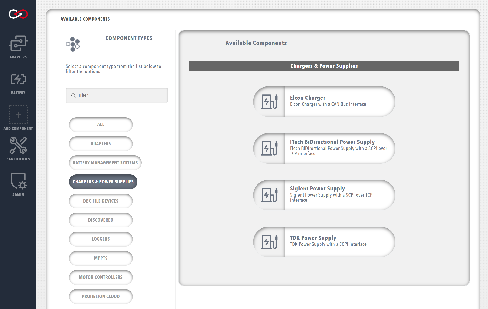
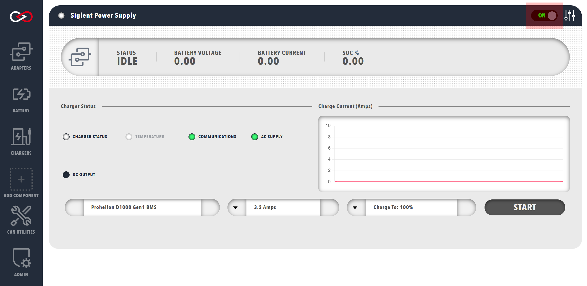
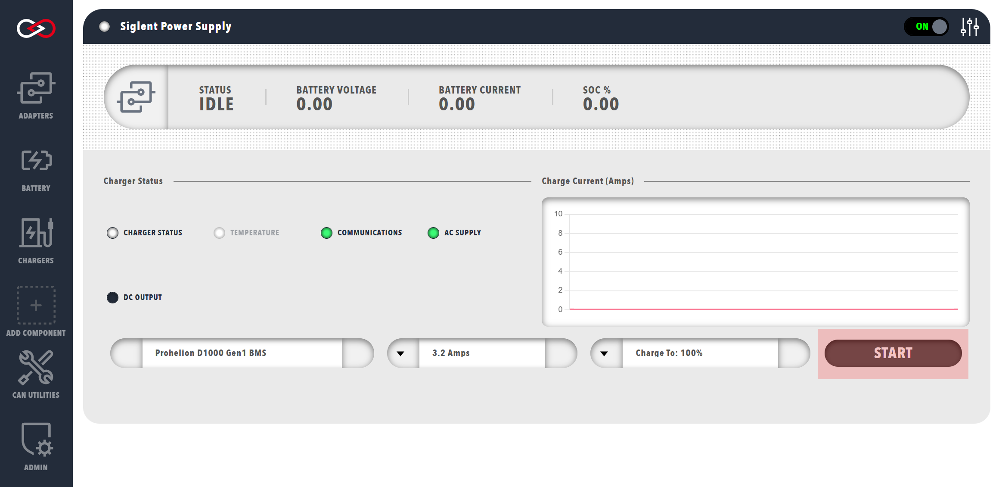

# Profinity Battery Charging

Profinity can manage charging of your pack by controlling your Prohelion BMU and a charger to put charge in the pack.

Profinity Charging supports four charging products (listed below) as well as balancing capabilities to ensure that your pack cells remain balanced and in good condition.

<figure markdown>

<figcaption>Siglent Charger</figcaption>
</figure>

## Supported Chargers

**TDK Power Supplies**

Profinity supports [TDK](https://www.tdk.com) Programmable Power Supplies such as the Genesys family. Profinity supports the TDK Power Supplies via their TCP interface.  For TDK Power supplies that only have a serial interfaces for programming it is necessary to add a [TCP to Serial Converter](https://www.jaycar.com.au/serial-to-ethernet-converter/p/XC4134) into the solution so that Profinity can communicate via TCP.

**Elcon Chargers**

Elcon Chargers are widely used in the EV industry and Profinity supports controlling the Elcon Charger via its CAN bus interface. To operate a Elcon Charger via CAN bus the charger must be connected to a CAN bus interface that is configured in Profinity.

**Signet Power Supplies**

The Signet Power Supplies that support a programmable TCP interface can be controlled by Profinity.  Units such as the [Siglent SPD3303X-E](https://siglentna.com/power-supplies/spd3303x-spd3303x-e-series-programmable-dc-power-supply/) are widely used by Prohelion clients for desktop testing scenarios.

**ITech Power Supplies**

[ITech](https://www.itechate.com/en/) provides a large range of bi-directional power supplies that are supported by the Profinity solution.  Profinity uses ITech's TCP interface for controlling the supply at this time we do not support the ITech CAN bus interface.

## Charging Steps

### Step 1 - Add a Charger to your Profile

A charger is configured as a device in Profinity so the first step to charging your pack is to add a charger to your Profile.  **Note your Profile needs to also include a Prohelion BMU so that the battery can be controlled by Profinity**

<figure markdown>

<figcaption>Add an Charger</figcaption>
</figure>

 
### Step 2 - Connect to your Charger

By default chargers in Profinity do not auto connect (this can be changed in the charger Profile settings if you do want to auto connect your charger).  Once your charger is connected and the light is green, click the charge button. 

<figure markdown>

<figcaption>Connect the Charger</figcaption>
</figure>

 
### Step 3 - Engage Contactors, Start Charging

Once everything is configured, charging the pack is a three step process;

__1.__ Set the max charge current that you want to apply to the pack

__2.__ Engage the contactors using the "Engage Contactors" button

__3.__ Press the "Start Charge" button

Charge will then flow to the pack from the charger.

<figure markdown>

<figcaption>Connect the Charger</figcaption>
</figure>

## Troubleshooting Charging

Charging can be complex to setup at times as it requires both the charger and Prohelion BMU to be managed to operate as expected.

Key things to considering if you are troubleshooting a charging setup:

**Are your devices working independently?**

Make sure all devices in the configuration are showing the Green circle in the Profile window.  If a device is grey or red then it should be fixed so that it is working fully before you start charging

**Make sure your pack engages as expected**

A common issue we see with charging is where there is current flow from the battery into the charger during pre-charge.  If this is occurring it can cause the pre-charge sequence to fail and the pack will not engage.  

This issue can be tested outside of charging by simply trying to engage the pack with the "Engage Contactors" button, while connected to the charger.  If the contactors do not engage while connected to the charger then the issue exists.

This problem can typically be solved by putting a suitably sized diode in to the charger circuit to ensure that current can only flow from the charger to the pack and not the other way.

**Be aware of maximum currents and voltages**

The Profile configuration for your charger sets the maximum voltages and currents that the charger and wall circuit can supply.

Be aware of these values when configuring your charger as it may be possible to overload the wall circuit if you are drawing too much power from your charger for the circuit.

It is also very important to be aware of the maximum current that you battery can take during a charge process.  

Profinity is not aware of your battery configuration beyond the information provided by the BMU.  Keep the maximum current at or below the recommended currents for your cells to ensure that your batteries are not damaged in the charge process.