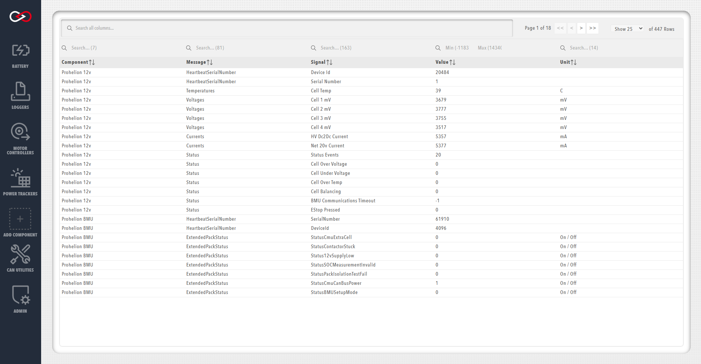

!!! tip "Profinity V2 IS NOW IN EARLY ADOPTER RELEASE"
    Profinity V2 is available now in Early Adopter Release.  To support this release we are making the product available to our Early Adopter Community.  If you have any issues or feedback please report it via our support portal or via the Feedback form in the Profinity Admin menu.

# CAN Bus DBC

[DBC](http://socialledge.com/sjsu/index.php/DBC_Format) is a file format that can be used to describe the format and nature of CAN Bus data.  With a DBC file CAN data can be understood more clearly and broken down in to Signals and Messages, the fundamental building blocks of a DBC file.

For the moment, Profinity provides a DBC Viewer that can be used to take a DBC file and will show the CAN Bus traffic travelling through the Profinity system as Messages and Signals.

<figure markdown>

<figcaption>CAN DBC Viewer</figcaption>
</figure>

To use the DBC viewer with a third party DBC file you need to [create a new component](../../Getting_Started/Adding_New_Components.md) in your [Profile](../../Administration/Profiles.md) and in the configuration properties for that new item provide the DBC file.  

Once this has been done then you will see the item in your profile and by right mouse clicking on it you can access information about its Messages and Signals.

Many of the other components supported by Profinity such as the [Elmar Solar MPPT](../MPPT/index.md) and the [WaveSculptor](../Motor_Controller/index.md) have support for DBC built in to the component and also allow you to view Messages and Signals, without requiring a separate DBC file.