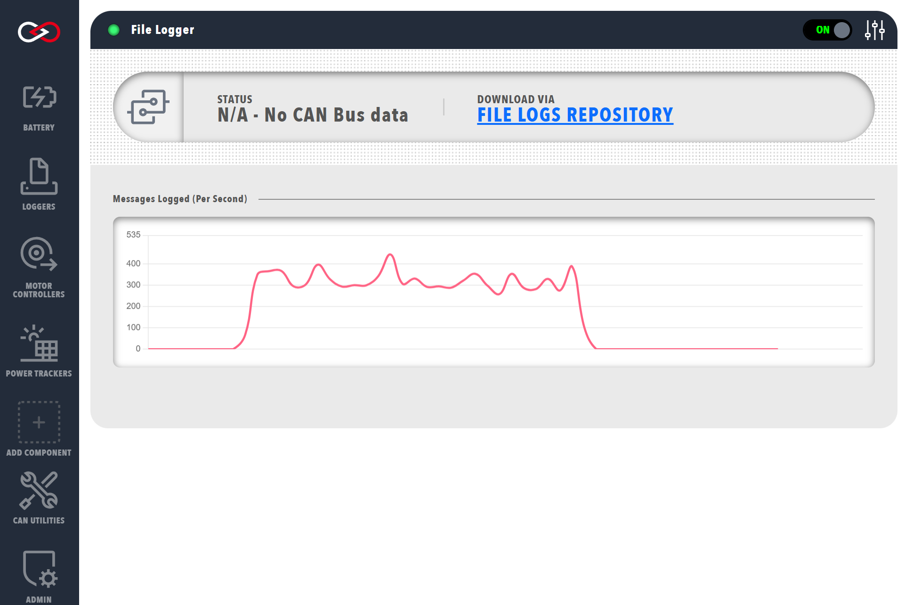

!!! tip "Profinity V2 IS NOW IN EARLY ADOPTER RELEASE"
    Profinity V2 is available now in Early Adopter Release.  To support this release we are making the product available to our Early Adopter Community.  If you have any issues or feedback please report it via our support portal or via the Feedback form in the Profinity Admin menu.

# File / FTP / SFTP Based Loggers

File loggers in Profinity are used to log native CAN Bus messages to a file, that can then be either stored locally or transmitted remotely to a FTP or SFTP server.

## Modes of Operation

File based loggers in Profinity have three potential modes of operation, you can either

| Log Mode                | Details                                                                             |
|-------------------------|-------------------------------------------------------------------------------------|
| `Log Locally to Disk`   | Writes the log files to your local file system.                                     |
| `Log Remotely via FTP`  | As well as logging locally this option takes the log file and places it on a remote FTP server for off site analysis.                                                                                   |
| `Log Remotely via SFTP` | As per FTP, but this time a Secure FTP (SFTP) end point is used as the destination. | 

Depending on the item you select, Profinity will present you with different destination options.  For FTP and SFTP it is necessary to provide the destination server, username and password.  For local logging only a directory is required.

The logger also gives you the ability to manage Archive and Compression settings, if you wish to archive your messages you must provide an archive directory.

| Setting                 | Purpose                                                                        |
|-------------------------|--------------------------------------------------------------------------------|
| `Compress Logs`         | Once a log file has reached the size limit, then it is compressed.             |
| `Archive Old Logs`      | Older log files are rotated to an archive directory based on a rotation policy |
| `Limit Archive Size To` | Maintains a maximum number of log files at this number, older logs are deleted |

Finally the logger allows you to set the frequency of rotation.  Rotation means that the old log file is closed and a new one is created and Profinity allows you to define a minute based log rotation or a size base log rotation depending on your preference.

Logging configurations are stored as part of your profile so when you load a profile, if you have the logger setup to automatically start then it will start logging automatically.

## Downloading the Logged Files

Once a CAN Bus file has been created it can be downloaded from Profinity by clicking on the link found on the Logger Dashboard

<figure markdown>

<figcaption>Download Log File</figcaption>
</figure>