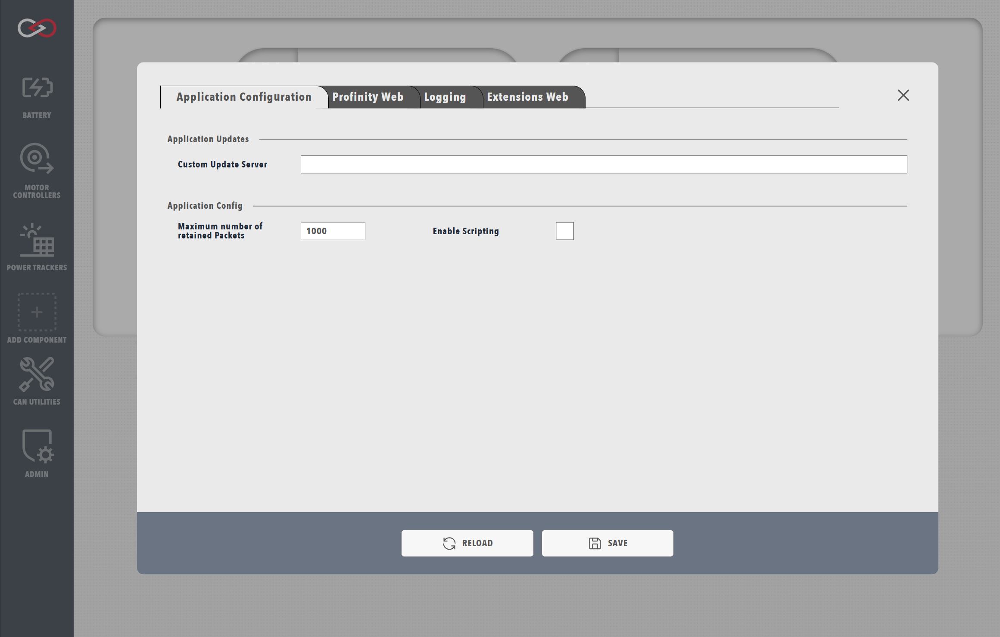

!!! tip "Profinity V2 IS NOW IN EARLY ADOPTER RELEASE"
    Profinity V2 is available now in Early Adopter Release.  To support this release we are making the product available to our Early Adopter Community.  If you have any issues or feedback please report it via our support portal or via the Feedback form in the Profinity Admin menu.

# Profinity Scripting

Welcome to the Profinity Scripting documentation. This section provides comprehensive information about scripting in Profinity, including supported languages, script types, and available operations.

If you're new to Profinity scripting, here is a few things to know before you get started.

## Important Read This First

!!! warning "Profinity Scripts Execute With the Same Security Permissions as Profinity Itself"
    Because Profinity Scripting runs inside the Profinity engine, any script will execute at the same level of Operating System security permissions as Profinity itself.  Because of this it is important to make sure that you understand what scripts are running on your system and what they do.

In order to ensure your Profinity environment remains secure, we require explicit enabling of the Scripting capabilities inside Profinity before they can be used.  

To enable Profinity Scripting, go to the [System Configuration](../../Administration/System_Config.md) and enabling Scripting.

<figure markdown>

<figcaption>Profinity System configuration</figcaption>
</figure>

## Script Types

Profinity supports three types of scripts, each designed for specific use cases:

- [Run Scripts](./Script_Types/RunScripts.md): For manual or scheduled operations
- [Receive Scripts](./Script_Types/ReceiveScripts.md): For handling incoming CAN messages
- [Service Scripts](./Script_Types/ServiceScripts.md): For continuous, long-running operations

Learn more about script types in our [Script Types](./Script_Types/index.md) documentation.

## Supported Languages

Profinity scripting supports three programming languages, you can code in any of these supported languages:

- C#: For complex, type-safe operations
- JavaScript: For quick scripting and prototyping
- Python: For data processing and analysis

Each language has its strengths and ideal use cases. See the [Supported Languages](./Supported_Languages/index.md) documentation for detailed comparisons.

## Operations

Profinity provides various out of the box operations to support your script development:

- [CANBus](./Operations/CANBus.md): For CAN communication
- [DBC](./Operations/DBC.md): For DBC Message and Signal handling
- [State](./Operations/State.md): For data persistence
- [Console](./Operations/Console.md): For output and logging

You can find out more about each in our [Operations](./Operations/index.md) documentation.

## Next Steps

1. Review the [Supported Languages](./Supported_Languages/index.md) guide to help select the right language for you
2. Learn about [Script Types](./Script_Types/index.md) to determine what script style might be most suitable
3. Explore the available [Operations](./Operations/index.md) and things you can do with Scripts
4. Try creating your first script 