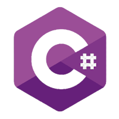

!!! tip "Profinity V2 IS NOW IN EARLY ADOPTER RELEASE"
    Profinity V2 is available now in Early Adopter Release.  To support this release we are making the documentation public.  To get access to the Profinity V2 installers, please log a support request at the [Prohelion Support Portal](https://prohelion.atlassian.net/servicedesk/customer/portals) requesting access to the Early Adopter release.

# Extending Profinity

Profinity offers a robust platform that can be extended and customized to meet your specific needs. By leveraging the Profinity [Scripting](./Scripting/index.md), [APIs](./APIs/index.md), and [Hosting](./Hosting/index.md) capabilities, you can transform Profinity into a powerful application server that can host your own custom applications and code, while using the power of Profinity to drive your systems and gather data. 

This flexibility allows you to tailor Profinity to your organization's unique requirements, enhancing its functionality and usability.

## Scripting

Profinity's [scripting capabilities](./Scripting/index.md) allow you to automate tasks and create custom operations. 

With support for languages like C#, JavaScript, and Python, you can choose the best tool for your needs. Scripting in Profinity enables you to handle various operations, from manual tasks to continuous, long-running processes. This is particularly useful for organizations that need to automate repetitive tasks, integrate with other systems, or create custom workflows that align with your business processes.

| C# Scripting                        | Python                                   | JavaScript                                       |
|-------------------------------------|------------------------------------------|--------------------------------------------------|
| |  |  |

## APIs

Profinity is built around a modern API architecture, providing [RESTful interfaces](./APIs/index.md) that allow you to integrate and extend its functionality. The APIs are secure and support JSON, making it easy to build custom applications or extend existing ones. 

With Profinity's APIs, you can access both real-time and historical data, ensuring you have the information you need at your fingertips. This is ideal for organizations that need to integrate Profinity with other systems, create custom dashboards, or develop new applications that leverage Profinity's data and capabilities.

Profinity supports [Swagger](https://swagger.io/) to make it easy to understand what APIs are available in Profinity and how to use them.

<!-- Update this image -->
<figure markdown>

<figcaption>Swagger from SmartBear</figcaption>
</figure>

## Scripting vs APIs

Profinity offers two completely different ways, Scripting and APIs that you can extend it's capabilities to meet the requirements of your applications.  Why would you choose one over the other?

| Scripting                                                                | APIs                                                                           |
| ------------------------------------------------------------------------ | ------------------------------------------------------------------------------ |
| Supports Python, Javascript and C#                                       | Support any Programming Language that can call REST APIs and JSON              |
| Are built in to Profinity and require no external frameworks or hosting  | Run outside of Profinity in your own environment, APP or cloud                 |
| Can be developed quickly and easily, to solve simple problems            | Can be as rich and complex as you want your app to be and still use Profinity  |
| Can run headless (no user interaction, scheduled or triggered by CAN)    | Requires you to write the logic for how your app uses the API                  |
| Script runs inside Profinity                                             | If scripted, your scripts run outside Profinity and can be distributed         |

Ultimately the decision on how to extend Profinity is up to you, but with two choices you have the flexibility to find the model that suits your needs best.

## Hosting

Profinity includes an [integrated web server](./Hosting/index.md) that allows you to host custom applications. Whether you're using modern web technologies like ReactJS or Angular, or traditional HTML and JavaScript, Profinity's hosting capabilities provide a flexible environment for your applications. 

The web server supports SSL/TLS certificates, ensuring your applications are secure in production environments. This is perfect for organizations that want to develop and deploy custom web applications that integrate seamlessly with Profinity, providing a unified user experience.

By combining these powerful features, Profinity can be extended to serve as a comprehensive application server, tailored to your organization's needs. This approach not only enhances the functionality of Profinity but also allows you to create a more integrated and efficient workflow, ultimately driving better business outcomes. 