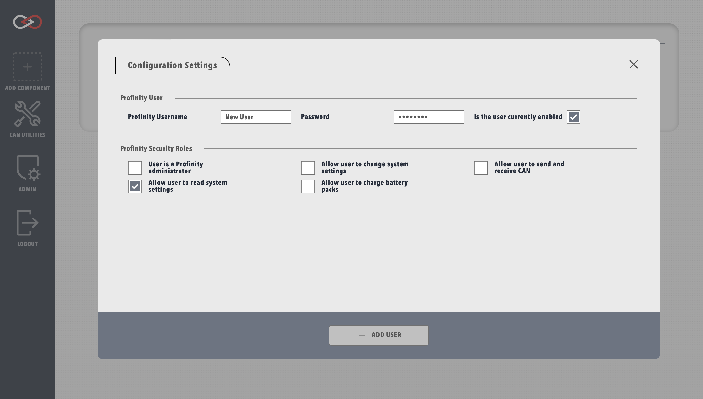

!!! tip "Profinity V2 IS NOW IN EARLY ADOPTER RELEASE"
    Profinity V2 is available now in Early Adopter Release.  To support this release we are making the documentation public.  To get access to the Profinity V2 installers, please log a support request at the [Prohelion Support Portal](https://prohelion.atlassian.net/servicedesk/customer/portals) requesting access to the Early Adopter release.

# Creating a User

After installing Profinity it is recommended to create a new user to suit your security requirements or create additional users as defined to support different user profiles. To create a new user, select the `ADMIN` tab, then `Users` and `+ ADD USER`. Here you are able to define a new user and their associated login details.

<figure markdown>

<figcaption>New user menu</figcaption>
</figure>

Each user can also be granted different security roles, either allowing or restricting certain Profinity functionality for that particular user. Giving a user the administrator role automatically grants the privileges of all other roles.

# More Information

Addition information on how to create and manage users can be found in the [Admin / Manage Users](../Administration/Manage_Users.md) section of this documentation.