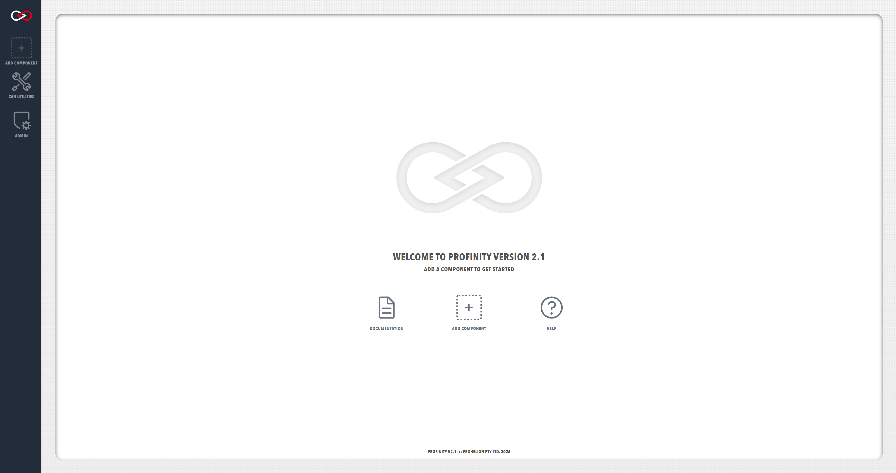

!!! tip "Profinity V2 IS NOW IN EARLY ADOPTER RELEASE"
    Profinity V2 is available now in Early Adopter Release.  To support this release we are making the documentation public.  To get access to the Profinity V2 installers, please log a support request at the [Prohelion Support Portal](https://prohelion.atlassian.net/servicedesk/customer/portals) requesting access to the Early Adopter release.

# Profinity Profiles

A Profile is the core mechanism by which Profinity maintains the configuration of your system. Any component that you add to your system becomes associated with the active Profile, and the configuration for each device is retained after Profinity is shut down. Profinity keeps track of your Profiles and loads the most recently used one each time you start the tool.

You can see the components that are in your Profile in the menu on the left of the screen and you can add to the Profile, but clicking on the [+ ADD COMPONENT](./Adding_New_Components.md) button in the left most menu of Profinity or on the home page.

<figure markdown>

<figcaption>Profinity homepage (showing the `+ ADD COMPONENT` button in both locations)</figcaption>
</figure>

# More Information

Addition information on how to create and manage Profiles can be found in the [Admin / Profiles](../Administration/Profiles.md) section of this documentation.