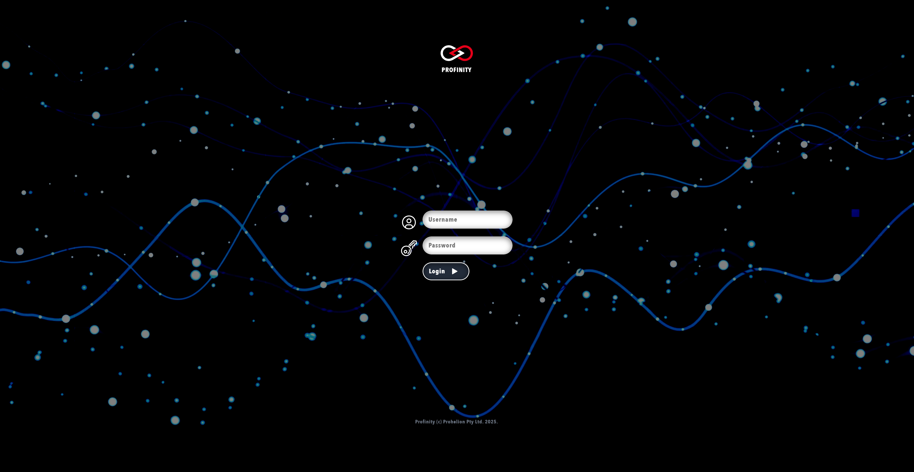

# Installing Profinity On Docker

!!! info "Available Profinity Releases"
    Profinity is currently available on [Windows machines](./Windows_Installation.md) as a standard desktop application, for selected [Unix Platforms (including macOS and Linux)](./Zip_Installation.md) and as a [Docker container](./Docker_Installation.md) for Docker enabled environments and Cloud setups.

## Installation using Docker

Profinity can be deployed onto most devices capable of running Docker, including macOS and Linux machines as well as several single-board computers such as Raspberry Pi, BeagleBone Black, etc.

### Prerequisites

The following items are required to be able to install Profinity:

- Docker installed on the target device
- Docker Compose installed on the target device (included with Docker Desktop, available as plugin on Linux machines)
- A suitable CAN adaptor for the target device

### Simple Setup

On the target device, create a new empty directory and a file titled `docker-compose.yml` in the new directory. The contents of the `docker-compose.yml` file should be

```
services:
  profinity:
      image: prohelion/profinity:latest
      restart: always
      #On linux hosts you can run in host mode to enable autodiscovery
      #network_mode: host
      ports:
        - 18080:18080
        - 18443:18443
        - 5000:5000
        - 4876:4876
```

For more information about Docker Compose, see the [official Docker documentation](https://docs.docker.com/compose/).

!!! info "Directly Accessing Devices"
    Docker deliberately does not expose all devices through to the containers that run the applications.  In some cases you may wish to expose additional devices to Docker so that you can access things like SocketCAN Natively or discover components that use UDP for broadcasting.  See the [official Docker documentation](https://docs.docker.com/compose/) for how to expose these devices to your Docker container.

### Starting and Stopping Profinity

The Profinity Docker container is started and stopped using commands from the [Docker Compose toolset](https://docs.docker.com/compose/reference/). First, navigate to the original directory (the one containing the `docker-compose.yml` file). Then, to begin Profinity, enter `docker compose up` into the command line.

To do so open the URL defined in the [Admin / System Configuration / Web panel](../Administration/System_Config.md) (i.e., `http://profinity:18080`) to access the Profinity web client. For users that followed the default setup procedure, the default URL is `http://localhost:18080` on the local machine or the IP address of the machine and `http://[Your IP Address]:18080` if accessed remotely.

Connecting to the Profinity web client will direct you to the Profinity login page. 

<figure markdown>

<figcaption>Profinity login page</figcaption>
</figure>

A fresh install of Profinity will only have the administrator user active. To log in, use the following login details.

Username: `admin`

Password: `password`

After logging in, you will arrive at the Profinity homepage.

<figure markdown>

<figcaption>Profinity homepage</figcaption>
</figure>

To stop Profinity, enter `docker compose down` into the command line.