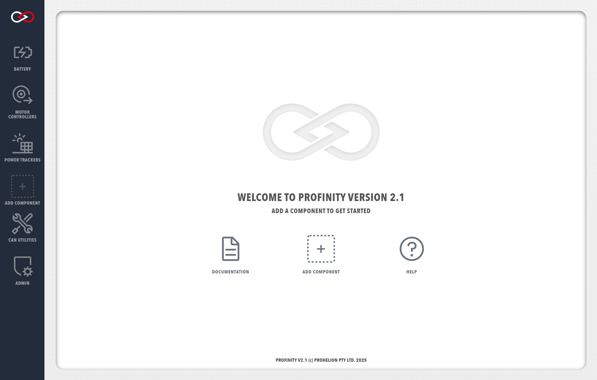

# Installing Profinity On macOS and Linux

!!! info "Available Profinity Releases"
    Profinity is currently available on [Windows machines](./Windows_Installation.md) as a standard desktop application, for selected [Unix Platforms (including macOS and Linux)](./Zip_Installation.md) and as a [Docker container](./Docker_Installation.md) for Docker enabled environments and Cloud setups.

## Zip Installation

Profinity is available as a Zip installation file for Unix and MacOS platforms, this approach does not require any installer but simply requires the files to be run with a version of the Microsoft ASP.NET Core 9.0 runtime.

To use this installation approach firstly download and install a ASP.NET Core 9 or above runtime (note we are currently only testing against .Net 9 releases so if you do use a more recent version you may have issues).  The ASP.NET Core runtime is the version of .Net that is required.

[Download ASP.NET Core 9 :material-download:](https://dotnet.microsoft.com/en-us/download/dotnet/9.0){ .md-button }

Once installed download the latest Profinity release .zip file from the  and unzip the file in to the folder that you wish to run Profinity on.

[Profinity Releases Page :material-download:](https://github.com/Prohelion/Profinity/releases){ .md-button }

### Starting and Stopping Profinity

To start Profinity from a Zip installation, go to the folder where Profinity has been unzipped and simply run the command

`dotnet Profinity.dll`

The following or similar should then appear.

```
Prohelion Profinity - v2.1.0.0
Profinity (c) 2023 - Prohelion Pty Ltd.
------------------------------------------
Press Ctrl-C to shut the application down.

INFO: Starting Prohelion - Profinity
INFO: Default Quartz.NET properties loaded from embedded resource file
INFO: Initialized Scheduler Signaller of type: Quartz.Core.SchedulerSignalerImpl
INFO: Quartz Scheduler created
INFO: RAMJobStore initialized.
INFO: Quartz Scheduler 3.13.1.0 - 'DefaultQuartzScheduler' with instanceId 'NON_CLUSTERED' initialized
INFO: Using thread pool 'Quartz.Simpl.DefaultThreadPool', size: 10
INFO: Using job store 'Quartz.Simpl.RAMJobStore', supports persistence: False, clustered: False
INFO: Scheduler DefaultQuartzScheduler_$_NON_CLUSTERED started.
INFO: Profinity Profile : Default 11
INFO: Profinity Services Starting
INFO: Now listening on: http://127.0.0.1:18080
```

With Profinity running, open the URL defined in the `Config.yaml` file (i.e., `http://profinity:18080`) to access the Profinity web client. 

Connecting to the Profinity web client will direct you to the Profinity login page. 

<figure markdown>

<figcaption>Profinity V2 login page</figcaption>
</figure>

A fresh install of Profinity will only have the administrator user active. To log in, use the following login details.

Username: `admin`

Password: `password`

After logging in, you will arrive at the Profinity homepage.

<figure markdown>

<figcaption>Profinity V2 homepage</figcaption>
</figure>

To stop Profinity, go to the terminal window running Profinity and press `Ctrl-C`